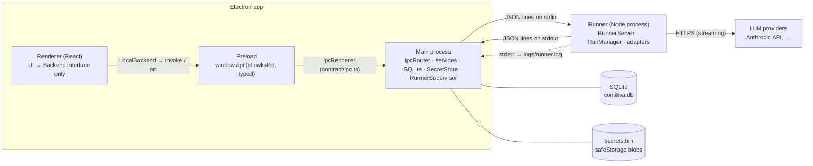

# Architecture

How Comitiva is put together: the processes, the runner protocol, and the boundaries between them. The domain model is in `SPEC.md`, class-level detail in `docs/design.md`, and decisions in `docs/adr/`.

## Processes



- **Renderer** — React 19, Zustand, Tailwind, i18next. It depends only on the `Backend` interface (`renderer/src/backend/Backend.ts`). `LocalBackend` implements it over `window.api`; `RemoteBackend` (Phase 8) will implement it over HTTP + WebSocket.
- **Preload** — Exposes `window.api = { invoke, on }` through `contextBridge`, allowlisted against the channel names in `@comitiva/contract/ipc-channels`. The window runs with `contextIsolation: true`, `sandbox: true`, `nodeIntegration: false`, a strict CSP, no navigation and no popups.
- **Main** — Validates every IPC input with the zod schemas in `contract/ipc.ts` and strips every output to its schema (`runInvoke`). Owns SQLite (Drizzle), the `SecretStore`, and the `RunnerSupervisor`. It is the only process that sees secret values; it sends them to the runner per request.
- **Runner** — A standalone Node process (`packages/runner/dist/bin.cjs`, self-contained). The desktop spawns it as `process.execPath` with `ELECTRON_RUN_AS_NODE=1` (ADR 0002). It is stateless as far as persistence goes: it receives the history and returns events. It must not import Electron (enforced by ESLint).

## Runner protocol

Transport: JSON lines. Each message is one JSON object followed by `\n`. Requests go to the runner's **stdin**, events come from its **stdout**. **stderr** is for logs only (pino; level from `COMITIVA_RUNNER_LOG`, default `warn`). Every line is validated against `RunnerRequest` / `RunnerEvent` in `@comitiva/contract` (JSON Schema in `packages/contract/schema/`).

### Requests (shell → runner)

| `type` | Payload | Result | Phase |
|---|---|---|---|
| `ping` | — | `{ version, protocolVersion }` | 0 |
| `connection.test` | `connection`, `secret?` | `{ ok: true, latencyMs } \| { ok: false, error }` | 0 |
| `connection.listModels` | `connection`, `secret?` | `ModelInfo[]` | 1 |
| `toolServer.start` / `toolServer.stop` | `toolServer`, `secrets?` / `toolServerId` | `ToolDef[]` / `{}` | 5 |
| `run.start` | `runId`, `conversationId`, `agent`, `connection`, `secret?`, `messages`, `harnessSessionId?`, `alwaysAllowed?` | `{ runId }` (returns right away; the run streams events) | 0 |
| `run.cancel` | `runId` | `{ cancelled: boolean }` (idempotent) | 0 |
| `run.approval` | `runId`, `toolUseId`, `decision` | `{}` | 5 |
| `shutdown` | — | `{}`, then the runner cancels runs and exits | 0 |

Each request has an `id` chosen by the shell. The runner answers exactly once with `{ type: 'response', id, ok, result | error }`. Requests not implemented yet answer `not_implemented`. Invalid requests answer `invalid_request`, echoing the `id` when one is present.

### Events (runner → shell)

| `type` | Fields |
|---|---|
| `response` | `id`, `ok`, `result` or `error: { code, message, retryable }` |
| `run.text_delta` | `runId`, `text` |
| `run.usage` | `runId`, `inputTokens`, `outputTokens`, `cacheReadTokens?`, `cacheWriteTokens?`, `estimated` |
| `run.done` | `runId`, `stopReason` (`end_turn`, `max_tokens`, `stop_sequence`, `tool_use`, `refusal`, `pause_turn`, `max_iterations`, `cancelled`, `other`) |
| `run.error` | `runId`, `code`, `message`, `retryable` |
| `run.session`, `run.block`, `run.tool_call`, `run.tool_result` | Phases 2 and 5 |
| `log` | `level`, `message` |

Every `run.*` event carries `ts`, the runner's emission time in epoch milliseconds with sub-ms precision (`performance.timeOrigin + performance.now()`). It is used to measure latency across processes.

### Run lifecycle

- Runs are independent and concurrent. Each has its own `AbortController` (`RunManager` → `Run`).
- Every run ends with **exactly one terminal event**, `run.done` or `run.error`, and emits nothing after it.
- **Cancel** aborts the provider request (the HTTP stream is closed), then emits the usage known so far and `run.done { stopReason: 'cancelled' }`. Cancel is not an error. If cancel lands before the provider reports output tokens, `outputTokens` is estimated from the streamed text and `estimated: true` is set.
- Provider errors become stable codes (`auth_failed`, `rate_limited`, `provider_unavailable`, `provider_error`, `timeout`, …). The raw provider message goes in `message` for logs and is never shown as a UI title.
- If the runner process dies, `RunnerClient` rejects pending requests and emits `run.error { code: 'runner_crashed', retryable: true }` for every active run. `RunnerSupervisor` restarts the process with exponential backoff (1 s, 2 s, 4 s … 30 s).

### Example session

```jsonl
→ {"id":"1","type":"ping"}
← {"type":"response","id":"1","ok":true,"result":{"version":"0.1.0","protocolVersion":1}}
→ {"id":"2","type":"run.start","runId":"r1","conversationId":"c1","agent":{…},"connection":{…},"secret":"sk-…","messages":[…]}
← {"type":"response","id":"2","ok":true,"result":{"runId":"r1"}}
← {"type":"run.text_delta","runId":"r1","text":"Hel","ts":1789741640695.31}
← {"type":"run.text_delta","runId":"r1","text":"lo","ts":1789741640712.02}
→ {"id":"3","type":"run.cancel","runId":"r1"}
← {"type":"response","id":"3","ok":true,"result":{"cancelled":true}}
← {"type":"run.usage","runId":"r1","inputTokens":12,"outputTokens":2,"cacheReadTokens":0,"cacheWriteTokens":0,"estimated":true,"ts":…}
← {"type":"run.done","runId":"r1","stopReason":"cancelled","ts":…}
```

Try it by hand: `pnpm --filter @comitiva/runner build && echo '{"id":"1","type":"ping"}' | node packages/runner/dist/bin.cjs`.

## Streaming path and batching

```
provider SSE → AnthropicAdapter → Run (stamps ts) → stdout
  → RunnerClient (parse + validate) → SpikeService / ConversationService
  → coalesce text per conversation, flush every 16 ms → webContents.send
  → preload → LocalBackend → Zustand store → React paint
```

Main forwards deltas to the renderer at most once per frame (16 ms) per conversation, instead of once per token. SQLite writes (from Phase 4) are batched separately, about every 250 ms. Measured latencies are in `docs/STATUS.md`.

## Boundaries (non-negotiable)

| Rule | Enforced by |
|---|---|
| `packages/runner` and `packages/mcp-servers` have zero Electron dependencies. | ESLint `no-restricted-imports` on those paths; the runner is tested under plain Node. |
| Secrets never touch SQLite, IPC payloads to the renderer, or logs. | The DB schema has only `secret_ref`. `runInvoke` strips outputs to their schema (tested). pino redacts `secret`/`apiKey`. The renderer drops the key draft after saving. |
| The renderer depends only on the `Backend` interface. | ESLint bans `electron`, `main/`, `preload/` and `@comitiva/runner` imports in the renderer, and `window.api` outside `LocalBackend.ts`. |
| The filesystem MCP server rejects paths outside the agent's roots, including symlink escapes. | Phase 5 (`RootGuard`). |
| Nothing in the core assumes code, Git or terminals. | Review. |

## Secrets

`ElectronSecretStore` encrypts values with `safeStorage` (Keychain / DPAPI / libsecret) and writes a JSON map of base64 blobs to `<userData>/secrets.bin`. Writes are atomic (tmp + rename, mode 0600) and serialized. When the OS offers no keyring (Linux `basic_text` backend), `safeStorage` refuses to encrypt and so does the store; the app then shows a warning. Tests and CI opt into obfuscated storage with `COMITIVA_ALLOW_WEAK_SECRET_STORAGE=1`.

## Data locations

`<userData>` is `~/.config/comitiva` (Linux), `~/Library/Application Support/comitiva` (macOS) or `%APPDATA%\comitiva` (Windows). Override it with `COMITIVA_USER_DATA`.

| File | Content |
|---|---|
| `comitiva.db` | SQLite (WAL), Drizzle migrations |
| `secrets.bin` | Encrypted secrets |
| `logs/runner.log` | Runner stderr and supervisor events (rotates at 5 MB) |
| `logs/latency.jsonl` | Event → paint latency samples reported by the renderer (spike) |
