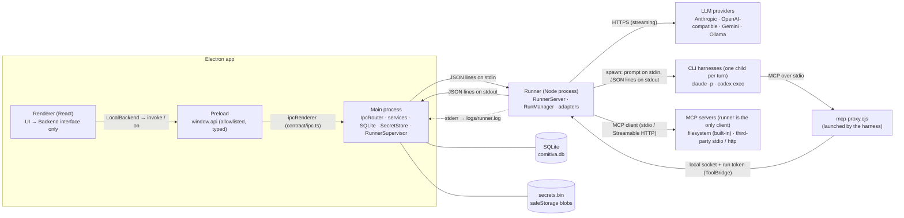

# Architecture

How Comitiva is put together: the processes, the runner protocol, and the boundaries between them. The domain model is in `SPEC.md`, class-level detail in `docs/design.md`, and decisions in `docs/adr/`.

## Processes



- **Renderer** — React 19, Zustand, Tailwind, i18next. It depends only on the `Backend` interface (`renderer/src/backend/Backend.ts`). `LocalBackend` implements it over `window.api`; `RemoteBackend` (Phase 8) will implement it over HTTP + WebSocket, against a hub from `comitiva-dev/hub`: a self-hosted community edition or the official hosted hub (ADR 0015).
- **Preload** — Exposes `window.api = { invoke, on }` through `contextBridge`, allowlisted against the channel names in `@comitiva/contract/ipc-channels`. The window runs with `contextIsolation: true`, `sandbox: true`, `nodeIntegration: false`, a strict CSP, no navigation and no popups.
- **Main** — Validates every IPC input with the zod schemas in `contract/ipc.ts` and strips every output to its schema (`runInvoke`). Owns SQLite (Drizzle), the `SecretStore`, and the `RunnerSupervisor`. It is the only process that sees secret values; it sends them to the runner per request.
- **CLI harnesses** — Claude Code and Codex, spawned by the runner for each turn in the conversation's working directory, in their own process group. They run non-interactively with auto-accept and use their own login (ADR 0007, `docs/providers.md` → CLI harnesses).
- **MCP servers** — Started by the runner, which is their only client (ADR 0009): the built-in `filesystem` server (`mcp-servers/filesystem.cjs`, run like the runner with the app's binary in Node mode, one instance per set of roots), the built-in `google-drive` server (`mcp-servers/google-drive.cjs`, launched with a fresh access token in env; OAuth and refresh stay in main, ADR 0010) and the servers the user adds. CLI harnesses reach them through `mcp-proxy.cjs`, which forwards to the runner over a local socket. How tools, roots and approvals work: `docs/tools.md`.
- **Runner** — A standalone Node process (`packages/runner/dist/bin.cjs`, self-contained). The desktop spawns it as `process.execPath` with `ELECTRON_RUN_AS_NODE=1` (ADR 0002). It is stateless as far as persistence goes: it receives the history and returns events. It must not import Electron (enforced by ESLint).

## Runner protocol

Transport: JSON lines. Each message is one JSON object followed by `\n`. Requests go to the runner's **stdin**, events come from its **stdout**. **stderr** is for logs only (pino; level from `COMITIVA_RUNNER_LOG`, default `warn`). Every line is validated against `RunnerRequest` / `RunnerEvent` in `@comitiva/contract` (JSON Schema in `packages/contract/schema/`).

### Requests (shell → runner)

| `type` | Payload | Result | Phase |
|---|---|---|---|
| `ping` | — | `{ version, protocolVersion }` | 0 |
| `connection.test` | `connection`, `secret?` | `{ ok: true, latencyMs } \| { ok: false, error }` (provider failures are a result, not a protocol error; 15 s deadline) | 0 |
| `connection.listModels` | `connection`, `secret?` | `ModelInfo[]` (`{ id, name?, contextWindow? }`); provider failures answer `ok: false` with the mapped code | 1 |
| `cli.detect` | `provider`, `binaryPath?` | `{ path, version }`; `binary_not_found` when missing or not answering `--version` | 2 |
| `toolServer.start` / `toolServer.stop` | `toolServer` (a `ToolServerLaunch`: stdio `command`/`args`/`env` or http `url`/`headers`, secrets resolved; `builtin?`), `roots?` / `toolServerId` | `ToolDef[]` (starts or reuses the client) / `{}` (closes every instance of the server) | 5 |
| `run.start` | `runId`, `conversationId`, `agent`, `connection`, `secret?`, `messages`, `harnessSessionId?`, `workingDirectory?` (CLI), `alwaysAllowed?` (`serverId:toolName`), `toolServers?` (`ToolServerLaunch[]`) | `{ runId }` (returns right away; the run streams events) | 0 / 5 |
| `run.cancel` | `runId` | `{ cancelled: boolean }` (idempotent) | 0 |
| `run.approval` | `runId`, `toolUseId`, `decision` (`allow`, `deny`, `allow-always`) | `{}` (a no-op when nothing waits) | 5 |
| `shutdown` | — | `{}`, then the runner cancels runs and exits | 0 |

Each request has an `id` chosen by the shell. The runner answers exactly once with `{ type: 'response', id, ok, result | error }`. Requests not implemented yet answer `not_implemented`. Invalid requests answer `invalid_request`, echoing the `id` when one is present.

### Events (runner → shell)

| `type` | Fields |
|---|---|
| `response` | `id`, `ok`, `result` or `error: { code, message, retryable }` |
| `run.text_delta` | `runId`, `text` |
| `run.usage` | `runId`, `inputTokens`, `outputTokens`, `cacheReadTokens?`, `cacheWriteTokens?`, `estimated` |
| `run.done` | `runId`, `stopReason` (`end_turn`, `max_tokens`, `stop_sequence`, `tool_use`, `refusal`, `pause_turn`, `max_iterations`, `cancelled`, `other`) |
| `run.error` | `runId`, `code`, `message`, `retryable` |
| `run.session` | `runId`, `harnessSessionId`: the CLI harness's session, sent before any output; the shell stores it and passes it back to resume (Phase 2) |
| `run.block` | `runId`, `block`: a complete block. CLI harnesses report the tools they ran as `tool_use` / `tool_result` blocks with `toolServerId: 'harness:<provider>'` (Phase 2) |
| `run.tool_call` | `runId`, `toolUseId`, `toolServerId`, `toolName` (the server's own name), `input`, `requiresApproval`: after the `tool_use` block; with `requiresApproval` the run waits for `run.approval` (Phase 5) |
| `run.tool_result` | `runId`, `toolUseId`, `output` (text/image/document blocks), `isError`, `durationMs`: the shell stores it as a `tool_result` block (Phase 5) |
| `log` | `level`, `message` |

Every `run.*` event carries `ts`, the runner's emission time in epoch milliseconds with sub-ms precision (`performance.timeOrigin + performance.now()`). It is used to measure latency across processes.

### Run lifecycle

- Runs are independent and concurrent. Each has its own `AbortController` (`RunManager` → `Run`).
- Every run ends with **exactly one terminal event**, `run.done` or `run.error`, and emits nothing after it.
- **Cancel** aborts the provider request (the HTTP stream is closed), then emits the usage known so far and `run.done { stopReason: 'cancelled' }`. Cancel is not an error. If cancel lands before the provider reports output tokens, `outputTokens` is estimated from the streamed text and `estimated: true` is set.
- Provider errors become stable codes, the same for every provider: 401/403 → `auth_failed`; 429 → `rate_limited` (retryable); 5xx → `provider_unavailable` (retryable); other 4xx → `provider_error`; no response → `provider_unavailable` or `timeout` (retryable). The raw provider message goes in `message` for logs and is never shown as a UI title. Adapter rules and how to add one: `docs/providers.md`.
- Adapters never read credentials or endpoints from the environment; the key arrives per request and is not stored. CLI harnesses get the runner's env minus Comitiva's variables and provider keys, so they use their own login.
- CLI harness turns: one child process per turn. The harness keeps the history (resume by `harnessSessionId`); without a session, or when the harness lost it, the history is replayed into a new one. Cancel kills the process group. A turn with no output for 10 minutes ends with `timeout`. CLI connection tests run a real minimal prompt, so `RunnerClient` waits up to 120 s for them.
- Tools (Phase 5, `docs/tools.md`): a run acquires the agent's MCP servers first (one that cannot start fails the run with `tool_server_failed`). Every call goes through the permission gate; `run.tool_call { requiresApproval: true }` waits for `run.approval`, and cancel ends the wait (or an in-flight call) at once. API adapters loop until the model stops calling tools or `params.maxToolIterations` (25) model calls, then `run.done { stopReason: 'max_iterations' }`. CLI harnesses call the same gate through the MCP proxy.
- If the runner process dies, `RunnerClient` rejects pending requests and emits `run.error { code: 'runner_crashed', retryable: true }` for every active run. `RunnerSupervisor` restarts the process with exponential backoff (1 s, 2 s, 4 s … 30 s).

### Example session

```jsonl
→ {"id":"1","type":"ping"}
← {"type":"response","id":"1","ok":true,"result":{"version":"0.1.0","protocolVersion":1}}
→ {"id":"2","type":"run.start","runId":"r1","conversationId":"c1","agent":{…},"connection":{…},"secret":"sk-…","messages":[…]}
← {"type":"response","id":"2","ok":true,"result":{"runId":"r1"}}
← {"type":"run.text_delta","runId":"r1","text":"Hel","ts":1789741640695.31}
← {"type":"run.text_delta","runId":"r1","text":"lo","ts":1789741640712.02}
→ {"id":"3","type":"run.cancel","runId":"r1"}
← {"type":"response","id":"3","ok":true,"result":{"cancelled":true}}
← {"type":"run.usage","runId":"r1","inputTokens":12,"outputTokens":2,"cacheReadTokens":0,"cacheWriteTokens":0,"estimated":true,"ts":…}
← {"type":"run.done","runId":"r1","stopReason":"cancelled","ts":…}
```

Try it by hand: `pnpm --filter @comitiva/runner build && echo '{"id":"1","type":"ping"}' | node packages/runner/dist/bin.cjs`.

## Streaming path and batching

```
provider stream → adapter (Anthropic / OpenAI-compatible / Gemini / Ollama) → Run (stamps ts) → stdout
  → RunnerClient (parse + validate) → ConversationService
  → coalesce text per conversation, flush every 16 ms → message.delta / message.block (rev) → webContents.send
  → preload → LocalBackend → messages store (applies by rev) → React paint
```

Main forwards deltas to the renderer at most once per frame (16 ms) per conversation, instead of once per token (measured in Phase 0). SQLite gets a checkpoint of the streaming reply about every 250 ms. The final state, the usage record and the conversation status are written in one transaction when the run ends. Every message event carries the conversation's `rev`, and `messages.list` returns the `rev` of its page, so a conversation opened mid-stream lines up with the stream (ADR 0008). Each conversation runs on its own, with no global queue, and at most one reply runs per conversation at a time (`conversation_busy`). Measured latencies are in `docs/STATUS.md`.

## Boundaries (non-negotiable)

| Rule | Enforced by |
|---|---|
| `packages/runner` and `packages/mcp-servers` have zero Electron dependencies. | ESLint `no-restricted-imports` on those paths; the runner is tested under plain Node. |
| Secrets never touch SQLite, IPC payloads to the renderer, or logs. | The DB schema has only `secret_ref` (tested). `runInvoke` strips outputs to their schema; connection outputs carry `hasSecret`, never a key (tested). pino redacts `secret`/`apiKey`. The form's typed key dies with the form, and the stored key is never sent back. The e2e scans `comitiva.db*` and `secrets.bin` for the keys. |
| The renderer depends only on the `Backend` interface. | ESLint bans `electron`, `main/`, `preload/` and `@comitiva/runner` imports in the renderer, and `window.api` outside `LocalBackend.ts`. |
| The filesystem MCP server rejects paths outside the agent's roots, including symlink escapes. | `RootGuard` in the server (realpath of candidate and roots), on every call; escape attempts tested against a temp dir and through the built app. Write tools exist only with `--gated-by-client`. |
| Tool calls that change things wait for the user (policy `ask`). | `PermissionGate` in the runner, for API runs and CLI harnesses (through the MCP proxy); tested per decision and in the e2e. |
| Nothing in the core assumes code, Git or terminals. | Review. |

## Secrets

`ElectronSecretStore` encrypts values with `safeStorage` (Keychain / DPAPI / libsecret) and writes a JSON map of base64 blobs to `<userData>/secrets.bin`. Writes are atomic (tmp + rename, mode 0600) and serialized. Keys are stored under `connection:<id>`; the `connections` row holds only that ref. Secret env vars and headers of tool servers are stored under `toolServer:<id>:env:<NAME>` / `toolServer:<id>:header:<NAME>`, and their rows hold only `{ secretRef }`. The Google OAuth client and the Drive account's tokens are stored under `google:oauthClient` and `google:tokens` (ADR 0010); the access token reaches the Drive server as env when it starts.

When the OS offers no keyring (Linux `basic_text` backend), the store **refuses** to save keys (`secret_store_unavailable`). The Connections screen shows a banner explaining how to get a keyring, and keyless connections (Ollama, LM Studio) keep working. This is the Phase 1 decision (SPEC §7). Tests and CI opt into obfuscated storage with `COMITIVA_ALLOW_WEAK_SECRET_STORAGE=1`.

## Data locations

`<userData>` is `~/.config/comitiva` (Linux), `~/Library/Application Support/comitiva` (macOS) or `%APPDATA%\comitiva` (Windows). Override it with `COMITIVA_USER_DATA`.

| File | Content |
|---|---|
| `comitiva.db` | SQLite (WAL), Drizzle migrations |
| `secrets.bin` | Encrypted secrets |
| `logs/runner.log` | Runner stderr and supervisor events (rotates at 5 MB) |
| `attachments/<ULID><ext>` | Files attached in the composer (0600); served to the renderer only through `comitiva-attachment://` (ADR 0012) |
| `workspaces/<conversationId>/` | Default working directory of a CLI harness conversation (unless the agent has a read-write root or the connection sets one) |

Outside `<userData>`: the runner's `ToolBridge` keeps its socket and, per harness turn, an MCP config and a token file in `<tmp>/comitiva-bridge-*/` (0700 dir, 0600 files, removed when the turn and the runner end).
