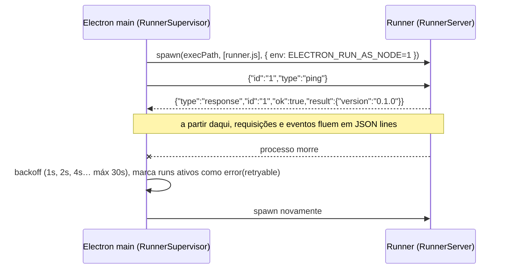

# Comitiva — Design Técnico

> A `SPEC.md` diz **o quê**; este documento diz **como**: passo a passo para iniciar, estrutura de arquivos, modelo de dados, classes e métodos principais, fluxos, comandos. É escrito para ser lido pelo Claude Code junto com o `SPEC.md`; os prompts de fase devem referenciá-lo.
>
> Assinaturas são esqueletos: nomes e responsabilidades importam, detalhes de implementação ficam para cada fase.

---

## 1. Como iniciar o projeto (Fase 0, passo a passo)

### 1.1 Pré-requisitos

| Ferramenta | Versão | Por quê |
|---|---|---|
| Node.js | 22 LTS | runner e Electron |
| pnpm | 9+ | workspaces |
| Git | qualquer | |
| Python 3 + build tools (Xcode CLT / VS Build Tools / `build-essential`) | | compilar `better-sqlite3` |
| Claude Code, Codex CLI | opcional | testar harnesses na Fase 2 |

### 1.2 Sequência de comandos

```bash
# 1. Repositório
mkdir comitiva && cd comitiva && git init
pnpm init
echo "node-linker=hoisted" > .npmrc        # electron-builder e módulos nativos preferem hoisted

# 2. Workspaces
cat > pnpm-workspace.yaml <<'EOF'
packages:
  - packages/*
  - apps/*
EOF
mkdir -p packages/{contract,runner,mcp-servers} apps/desktop docs/adr

# 3. Tooling raiz
pnpm add -Dw typescript turbo eslint prettier @eslint/js typescript-eslint \
  eslint-config-prettier vitest @types/node

# 4. Pacote contract
cd packages/contract && pnpm init && pnpm add zod && pnpm add -D zod-to-json-schema tsup && cd ../..

# 5. Pacote runner
cd packages/runner && pnpm init && pnpm add @anthropic-ai/sdk @modelcontextprotocol/sdk openai \
  @google/genai zod pino && pnpm add -D tsup msw && cd ../..

# 6. Servidores MCP embutidos
cd packages/mcp-servers && pnpm init && pnpm add @modelcontextprotocol/sdk zod && pnpm add -D tsup && cd ../..

# 7. Desktop (scaffold electron-vite dentro do monorepo)
pnpm create @quick-start/electron@latest apps/desktop -- --template react-ts
cd apps/desktop
pnpm add better-sqlite3 zustand react-markdown remark-gfm @tanstack/react-virtual i18next react-i18next
pnpm add -D @types/better-sqlite3 tailwindcss @tailwindcss/vite @electron/rebuild electron-builder \
  @playwright/test
cd ../..

# 8. Módulo nativo compilado para a versão do Electron
pnpm --filter desktop exec electron-rebuild -f -w better-sqlite3

# 9. Primeiro commit
git add -A && git commit -m "chore: bootstrap monorepo"
```

### 1.3 Arquivos de configuração raiz

`package.json` (raiz):

```json
{
  "name": "comitiva",
  "private": true,
  "scripts": {
    "dev": "turbo run dev --filter=desktop",
    "build": "turbo run build",
    "lint": "turbo run lint",
    "typecheck": "turbo run typecheck",
    "test": "turbo run test",
    "contract:schema": "pnpm --filter @comitiva/contract run schema",
    "runner:dev": "pnpm --filter @comitiva/runner run dev",
    "package": "pnpm --filter desktop run package"
  }
}
```

`turbo.json`:

```json
{
  "$schema": "https://turbo.build/schema.json",
  "tasks": {
    "build": { "dependsOn": ["^build"], "outputs": ["dist/**", "out/**", "schema/**"] },
    "dev": { "cache": false, "persistent": true, "dependsOn": ["^build"] },
    "lint": {},
    "typecheck": { "dependsOn": ["^build"] },
    "test": { "dependsOn": ["^build"] }
  }
}
```

`tsconfig.base.json` (estendido por todos os pacotes):

```json
{
  "compilerOptions": {
    "target": "ES2022", "module": "ESNext", "moduleResolution": "Bundler",
    "strict": true, "noUncheckedIndexedAccess": true, "exactOptionalPropertyTypes": true,
    "skipLibCheck": true, "esModuleInterop": true, "resolveJsonModule": true, "isolatedModules": true
  }
}
```

Ordem de build: `contract` → `runner` e `mcp-servers` → `desktop`. O `turbo` resolve isso pelo `dependsOn: ["^build"]`.

### 1.4 Nomes dos pacotes

| Diretório | `name` | Publicável |
|---|---|---|
| packages/contract | `@comitiva/contract` | sim (o hub Laravel consome o `schema/`) |
| packages/runner | `@comitiva/runner` | sim (bin `comitiva-runner`) |
| packages/mcp-servers | `@comitiva/mcp-servers` | sim (bins `comitiva-mcp-filesystem`, `comitiva-mcp-gdrive`) |
| apps/desktop | `desktop` | não |

### 1.5 Checklist de saída da Fase 0

- [ ] `pnpm lint && pnpm typecheck && pnpm test` verdes
- [ ] `pnpm dev` abre janela; `window.api.app.getVersion()` retorna a versão via IPC
- [ ] runner sobe como processo filho e responde `ping`
- [ ] spike: duas respostas Anthropic em streaming simultâneo, cancelar independente
- [ ] latência evento do runner → paint medida e anotada em `docs/STATUS.md`
- [ ] ADRs: ORM, licença, execução do runner, formato canônico de blocos
- [ ] CI verde em mac/win/linux

---

## 2. Estrutura de arquivos

```
packages/contract/src/
├── index.ts
├── entities/          connection.ts agent.ts conversation.ts message.ts tool-server.ts
│                      tool-approval.ts usage-record.ts usage-policy.ts
├── blocks.ts          Block = TextBlock | ImageBlock | DocumentBlock | ToolUseBlock | ToolResultBlock
├── provider-config.ts ConnectionConfig discriminated union por provider
├── runner-protocol.ts RunnerRequest, RunnerEvent
├── ipc.ts             contrato IPC do desktop (canais + schemas de entrada/saída)
└── schema.ts          script: zod → JSON Schema em ../schema/*.json

packages/runner/src/
├── bin.ts             entry: new RunnerServer(process.stdin, process.stdout).start()
├── server/            RunnerServer.ts Transport.ts RequestRouter.ts
├── runs/              RunManager.ts Run.ts ToolLoop.ts PermissionGate.ts
├── providers/         ProviderRegistry.ts ProviderAdapter.ts
│   ├── api/           AnthropicAdapter.ts OpenAICompatibleAdapter.ts GoogleAdapter.ts OllamaAdapter.ts
│   └── cli/           CliHarnessAdapter.ts ClaudeCodeAdapter.ts CodexAdapter.ts parsers/
├── mcp/               McpClientManager.ts McpClient.ts ToolCatalog.ts
├── usage/             UsageCalculator.ts pricing.json Tokenizer.ts
├── client/            RunnerClient.ts        (embutido pelos shells)
└── util/              jsonl.ts errors.ts logger.ts

packages/mcp-servers/src/
├── filesystem/        server.ts RootGuard.ts tools/*.ts approval.ts
└── google-drive/      server.ts drive-api.ts tools/*.ts

apps/desktop/src/
├── main/
│   ├── index.ts                 bootstrap: app.whenReady → Database → RunnerSupervisor → IpcRouter → window
│   ├── runner/                  RunnerSupervisor.ts
│   ├── db/                      Database.ts migrations/0001_init.sql ... repositories/*.ts
│   ├── secrets/                 SecretStore.ts ElectronSecretStore.ts
│   ├── services/                ConversationService.ts AgentService.ts ConnectionService.ts
│   │                            ToolServerService.ts ApprovalService.ts UsageService.ts TitleService.ts
│   ├── ipc/                     IpcRouter.ts handlers/*.ts
│   └── oauth/                   GoogleOAuth.ts (Fase 5b)
├── preload/index.ts             expõe window.api tipado a partir de contract/ipc.ts
└── renderer/src/
    ├── backend/                 Backend.ts LocalBackend.ts (RemoteBackend.ts na Fase 8)
    ├── store/                   agents.ts conversations.ts messages.ts ui.ts
    ├── components/              Sidebar/ Chat/ Composer/ ToolBlock/ ApprovalCard/ Forms/ Settings/
    ├── screens/                 ChatScreen ConnectionsScreen ToolsScreen UsageScreen SettingsScreen
    └── i18n/                    en.json pt-BR.json
```

---

## 3. Modelo de dados

### 3.1 Diagrama

```mermaid
erDiagram
    CONNECTION ||--o{ AGENT : "usa"
    AGENT ||--o{ CONVERSATION : "tem"
    CONVERSATION ||--o{ MESSAGE : "contém"
    AGENT }o--o{ TOOL_SERVER : "habilita (agent_tool_server)"
    AGENT ||--o{ AGENT_ROOT : "raízes"
    CONVERSATION ||--o{ TOOL_APPROVAL : "aprovações"
    MESSAGE ||--o{ USAGE_RECORD : "gera"
    CONNECTION ||--o{ USAGE_RECORD : "consumo"
    CONNECTION ||--o| USAGE_POLICY : "limite (Fase 10)"

    CONNECTION { text id PK; text name; text kind; text provider; json config; text secret_ref; int enabled; text created_at; text updated_at }
    AGENT { text id PK; text name; text avatar; text connection_id FK; text model; text role; json params; text permission_policy; json fallback_connection_ids; json tags; text created_at; text updated_at }
    AGENT_ROOT { text agent_id FK; text path; text mode }
    TOOL_SERVER { text id PK; text name; text transport; text command; json args; json env; text url; json headers; int builtin; int enabled }
    CONVERSATION { text id PK; text agent_id FK; text title; text status; text harness_session_id; int archived; text last_activity_at; text created_at }
    MESSAGE { text id PK; text conversation_id FK; text role; json content; text status; int seq; text created_at }
    TOOL_APPROVAL { text id PK; text conversation_id FK; text agent_id; text tool_server_id; text tool_name; text tool_use_id; json input; text decision; text decided_at }
    USAGE_RECORD { text id PK; text connection_id FK; text agent_id; text conversation_id; text message_id; text model; int input_tokens; int output_tokens; int cache_read_tokens; int cache_write_tokens; int estimated; real cost_usd; int latency_ms; text created_at }
    USAGE_POLICY { text connection_id PK; int max_tokens_day; real max_cost_day; int max_concurrent; text window_start; text window_end }
```

### 3.2 DDL inicial (SQLite, migration 0001)

```sql
CREATE TABLE connections (
  id TEXT PRIMARY KEY, name TEXT NOT NULL, kind TEXT NOT NULL CHECK (kind IN ('api','cli')),
  provider TEXT NOT NULL, config TEXT NOT NULL DEFAULT '{}', secret_ref TEXT,
  enabled INTEGER NOT NULL DEFAULT 1, created_at TEXT NOT NULL, updated_at TEXT NOT NULL
);

CREATE TABLE tool_servers (
  id TEXT PRIMARY KEY, name TEXT NOT NULL, transport TEXT NOT NULL CHECK (transport IN ('stdio','http')),
  command TEXT, args TEXT NOT NULL DEFAULT '[]', env TEXT NOT NULL DEFAULT '{}',
  url TEXT, headers TEXT NOT NULL DEFAULT '{}', builtin INTEGER NOT NULL DEFAULT 0,
  enabled INTEGER NOT NULL DEFAULT 1, created_at TEXT NOT NULL
);

CREATE TABLE agents (
  id TEXT PRIMARY KEY, name TEXT NOT NULL, avatar TEXT NOT NULL,
  connection_id TEXT NOT NULL REFERENCES connections(id) ON DELETE RESTRICT,
  model TEXT, role TEXT NOT NULL DEFAULT '', params TEXT NOT NULL DEFAULT '{}',
  permission_policy TEXT NOT NULL DEFAULT 'ask',
  fallback_connection_ids TEXT NOT NULL DEFAULT '[]', tags TEXT NOT NULL DEFAULT '[]',
  created_at TEXT NOT NULL, updated_at TEXT NOT NULL
);
CREATE INDEX idx_agents_connection ON agents(connection_id);

CREATE TABLE agent_roots (
  agent_id TEXT NOT NULL REFERENCES agents(id) ON DELETE CASCADE,
  path TEXT NOT NULL, mode TEXT NOT NULL CHECK (mode IN ('read','readwrite')),
  PRIMARY KEY (agent_id, path)
);

CREATE TABLE agent_tool_servers (
  agent_id TEXT NOT NULL REFERENCES agents(id) ON DELETE CASCADE,
  tool_server_id TEXT NOT NULL REFERENCES tool_servers(id) ON DELETE CASCADE,
  PRIMARY KEY (agent_id, tool_server_id)
);

CREATE TABLE conversations (
  id TEXT PRIMARY KEY, agent_id TEXT NOT NULL REFERENCES agents(id) ON DELETE CASCADE,
  title TEXT, status TEXT NOT NULL DEFAULT 'idle',
  harness_session_id TEXT, archived INTEGER NOT NULL DEFAULT 0,
  last_activity_at TEXT NOT NULL, created_at TEXT NOT NULL
);
CREATE INDEX idx_conversations_agent ON conversations(agent_id, archived, last_activity_at DESC);

CREATE TABLE messages (
  id TEXT PRIMARY KEY, conversation_id TEXT NOT NULL REFERENCES conversations(id) ON DELETE CASCADE,
  role TEXT NOT NULL CHECK (role IN ('user','assistant','tool')),
  content TEXT NOT NULL DEFAULT '[]', status TEXT NOT NULL DEFAULT 'complete',
  seq INTEGER NOT NULL, created_at TEXT NOT NULL
);
CREATE UNIQUE INDEX idx_messages_conv_seq ON messages(conversation_id, seq);

CREATE TABLE tool_approvals (
  id TEXT PRIMARY KEY, conversation_id TEXT NOT NULL REFERENCES conversations(id) ON DELETE CASCADE,
  agent_id TEXT NOT NULL, tool_server_id TEXT NOT NULL, tool_name TEXT NOT NULL,
  tool_use_id TEXT NOT NULL, input TEXT NOT NULL,
  decision TEXT NOT NULL CHECK (decision IN ('allow','deny','allow-always')), decided_at TEXT NOT NULL
);
CREATE INDEX idx_approvals_always ON tool_approvals(agent_id, tool_server_id, tool_name) WHERE decision = 'allow-always';

CREATE TABLE usage_records (
  id TEXT PRIMARY KEY, connection_id TEXT NOT NULL, agent_id TEXT NOT NULL,
  conversation_id TEXT NOT NULL, message_id TEXT, model TEXT NOT NULL,
  input_tokens INTEGER, output_tokens INTEGER, cache_read_tokens INTEGER, cache_write_tokens INTEGER,
  estimated INTEGER NOT NULL DEFAULT 0, cost_usd REAL, latency_ms INTEGER, created_at TEXT NOT NULL
);
CREATE INDEX idx_usage_conn_time ON usage_records(connection_id, created_at);
CREATE INDEX idx_usage_agent_time ON usage_records(agent_id, created_at);

CREATE TABLE schema_migrations (version INTEGER PRIMARY KEY, applied_at TEXT NOT NULL);
```

Convenções: ids são ULID (ordenáveis); datas ISO 8601 UTC; JSON em colunas TEXT validado por zod ao ler e escrever; `seq` em `messages` é incrementado por conversa e serve para ordenação e para reconciliação com o hub.

### 3.3 Blocos de mensagem (canônico)

```ts
type Block =
  | { type: 'text'; text: string }
  | { type: 'image'; source: { kind: 'base64'; mediaType: string; data: string } | { kind: 'file'; path: string } }
  | { type: 'document'; name: string; mediaType: string; source: /* idem */ }
  | { type: 'tool_use'; id: string; toolServerId: string; name: string; input: unknown }
  | { type: 'tool_result'; toolUseId: string; content: Block[]; isError: boolean; durationMs?: number };
```

Mensagem `assistant` pode misturar `text` e `tool_use`; a mensagem `tool` seguinte carrega os `tool_result`. Adaptadores traduzem para o formato do provider (OpenAI usa `tool_calls`/`role: tool`; Gemini usa `functionCall`/`functionResponse`).

---

## 4. Runner

### 4.1 Ciclo de vida



### 4.2 Classes

```ts
// server/Transport.ts — JSON lines sobre streams
class JsonLinesTransport {
  constructor(input: NodeJS.ReadableStream, output: NodeJS.WritableStream);
  onMessage(handler: (msg: unknown) => void): void;
  send(msg: RunnerEvent): void;        // serializa + '\n'; nunca lança
}

// server/RunnerServer.ts
class RunnerServer {
  constructor(transport: JsonLinesTransport, deps: { registry: ProviderRegistry; mcp: McpClientManager; runs: RunManager });
  start(): void;                        // valida cada linha com RunnerRequest schema, despacha ao RequestRouter
  stop(): Promise<void>;                // cancela runs, fecha clientes MCP
}

// server/RequestRouter.ts
class RequestRouter {
  handle(req: RunnerRequest): Promise<unknown>;   // switch por req.type → método correspondente
  // connection.test → registry.get(provider).testConnection
  // connection.listModels → registry.get(provider).listModels
  // toolServer.start/stop → mcp.start/stop
  // run.start → runs.start ; run.cancel → runs.cancel ; run.approval → runs.resolveApproval
}

// runs/RunManager.ts — um Run por runId, todos concorrentes
class RunManager {
  start(req: RunStartRequest): void;                 // cria Run, não bloqueia
  cancel(runId: string): void;                       // AbortController.abort()
  resolveApproval(runId: string, toolUseId: string, decision: ApprovalDecision): void;
  active(): string[];
}

// runs/Run.ts
class Run {
  constructor(req: RunStartRequest, adapter: ProviderAdapter, tools: ToolCatalog, gate: PermissionGate, emit: (e: RunnerEvent) => void);
  execute(): Promise<void>;
  // monta RunInput, cria RunContext { tools, callTool }, itera adapter.run(...)
  // traduz AdapterEvent → RunnerEvent com runId; mede latência; coleta usage
  private callTool(toolUseId: string, name: string, input: unknown): Promise<ToolResult>;
  // → gate.check(...) → se precisa aprovação, emite run.tool_call{requiresApproval:true} e aguarda promise
  // → tools.call(...) → emite run.tool_result
}

// runs/ToolLoop.ts — usado pelos adaptadores de API
async function* toolLoop(opts: {
  callModel: (messages: Message[], tools: ToolDef[], signal: AbortSignal) => AsyncIterable<AdapterEvent>;
  ctx: RunContext; messages: Message[]; maxIterations: number; signal: AbortSignal;
}): AsyncIterable<AdapterEvent>
// loop: chama modelo → acumula tool_use → para cada um, ctx.callTool → anexa tool_result → repete até stopReason != 'tool_use'

// runs/PermissionGate.ts
class PermissionGate {
  constructor(policy: PermissionPolicy, alwaysAllowed: Set<string> /* `${serverId}:${tool}` */);
  check(tool: ToolDef): 'allow' | 'ask' | 'deny';
  // read-only (annotations.readOnlyHint) → allow
  // policy read-only + tool não read-only → deny
  // allow-always registrado → allow ; policy allow-writes → allow ; senão ask
}
```

```ts
// providers/ProviderAdapter.ts
interface ProviderAdapter {
  readonly id: ProviderId;
  readonly kind: 'api' | 'cli';
  readonly capabilities: Capabilities;
  testConnection(config: ConnectionConfig, secret?: string): Promise<TestResult>;
  listModels?(config: ConnectionConfig, secret?: string): Promise<ModelInfo[]>;
  run(input: RunInput, ctx: RunContext, signal: AbortSignal): AsyncIterable<AdapterEvent>;
}

interface RunContext {
  tools: ToolDef[];                                            // agregadas dos servidores do agente
  callTool(toolUseId: string, name: string, input: unknown): Promise<ToolResult>;
  mcpConfigForCli(): Promise<{ path: string; cleanup(): void }>; // arquivo temporário para harnesses
  log(level: 'debug' | 'info' | 'warn', msg: string): void;
}

// providers/ProviderRegistry.ts
class ProviderRegistry {
  register(adapter: ProviderAdapter): void;
  get(id: ProviderId): ProviderAdapter;                        // lança UnknownProviderError
  list(): ProviderDescriptor[];                                // usado pela UI para montar formulários
}

// providers/api/AnthropicAdapter.ts (padrão para os demais)
class AnthropicAdapter implements ProviderAdapter {
  private client(config, secret): Anthropic;
  private toProviderMessages(messages: Message[]): MessageParam[];   // Block[] → formato Anthropic
  private toProviderTools(tools: ToolDef[]): Tool[];
  run(input, ctx, signal) { return toolLoop({ callModel: (m, t, s) => this.stream(m, t, s), ... }); }
  private async *stream(...): AsyncIterable<AdapterEvent>;          // SDK stream → text_delta/tool_use/usage/done
}

// providers/cli/CliHarnessAdapter.ts
abstract class CliHarnessAdapter implements ProviderAdapter {
  kind = 'cli' as const;
  protected abstract buildArgs(input: RunInput, mcpConfigPath?: string): string[];
  protected abstract parseLine(line: string): AdapterEvent[];    // uma linha JSON → zero ou mais eventos
  protected abstract versionArgs(): string[];
  protected locateBinary(config: CliConfig): Promise<string>;     // config.binaryPath || which()
  protected spawn(bin, args, opts: { cwd; env; signal }): ChildProcess;
  async *run(input, ctx, signal) { /* mcp config → spawn → readline stdout → parseLine → yield; stderr → error */ }
  async testConnection(config) { /* locate → --version → prompt mínimo */ }
}
class ClaudeCodeAdapter extends CliHarnessAdapter { /* -p, --output-format stream-json, --resume, --mcp-config */ }
class CodexAdapter extends CliHarnessAdapter { /* exec --json ... verificado no --help */ }
```

```ts
// mcp/McpClientManager.ts
class McpClientManager {
  start(server: ToolServer, secrets: Record<string, string>): Promise<ToolDef[]>;  // idempotente
  stop(serverId: string): Promise<void>;
  catalogFor(serverIds: string[]): ToolCatalog;
  private restartOnFailure(serverId: string): void;
}

// mcp/ToolCatalog.ts — visão agregada para um run
class ToolCatalog {
  defs(): ToolDef[];                                            // nomes prefixados: `${serverSlug}__${tool}` para evitar colisão
  call(name: string, input: unknown, signal: AbortSignal): Promise<ToolResult>;
  resolve(name: string): { serverId: string; tool: ToolDef };
}

// usage/UsageCalculator.ts
class UsageCalculator {
  constructor(pricing: PricingTable, overrides?: PricingTable);
  cost(model: string, usage: TokenUsage): number | null;
  estimate(messages: Message[], output: string): TokenUsage;   // fallback aproximado, estimated=true
}

// client/RunnerClient.ts — o que os shells embutem
class RunnerClient extends EventEmitter {
  constructor(opts: { spawn: () => ChildProcess; requestTimeoutMs?: number });
  start(): Promise<void>;                                       // spawn + ping
  request<T>(req: Omit<RunnerRequest, 'id'>): Promise<T>;       // correlaciona por id
  startRun(req: RunStartPayload): { runId: string };
  cancelRun(runId: string): void;
  approve(runId: string, toolUseId: string, decision: ApprovalDecision): void;
  on(event: 'run.event', h: (e: RunnerEvent) => void): this;
  on(event: 'crash', h: (code: number | null) => void): this;
  stop(): Promise<void>;
}
```

### 4.3 Fluxo de um turno com ferramenta e aprovação

```mermaid
sequenceDiagram
    actor U as Usuário
    participant UI as Renderer
    participant CS as ConversationService (main)
    participant RC as RunnerClient
    participant R as Run (runner)
    participant A as Adapter (API)
    participant FS as MCP filesystem

    U->>UI: envia "reorganize os relatórios"
    UI->>CS: sendMessage(convId, blocks)
    CS->>CS: persiste msg user; status=running
    CS->>RC: run.start {agent, connection, secret, messages, alwaysAllowed}
    RC->>R: JSON line
    R->>A: run(input, ctx)
    A-->>R: text_delta*
    R-->>CS: run.text_delta (batched no CS a cada ~50ms)
    CS-->>UI: stream
    A-->>R: tool_use fs__list_dir
    R->>R: gate.check → allow (read-only)
    R->>FS: tools/call list_dir
    FS-->>R: resultado
    R-->>CS: run.tool_call{requiresApproval:false}, run.tool_result
    A-->>R: tool_use fs__move
    R->>R: gate.check → ask
    R-->>CS: run.tool_call{requiresApproval:true}
    CS->>CS: status=awaiting-approval
    CS-->>UI: ApprovalCard
    U->>UI: "Permitir sempre"
    UI->>CS: approve(convId, toolUseId, 'allow-always')
    CS->>CS: grava tool_approval
    CS->>RC: run.approval
    RC->>R: JSON line → promise resolvida
    R->>FS: tools/call move
    FS-->>R: ok
    R-->>CS: run.tool_result
    A-->>R: text_delta* , done, usage
    R-->>CS: run.usage, run.done
    CS->>CS: persiste msg assistant/tool, usage_record; status=idle
    CS-->>UI: done
```

Batching: o `ConversationService` acumula `text_delta` e escreve no SQLite a cada ~250 ms ou ao fim do run; para a UI, encaminha a cada ~50 ms. Nunca um `UPDATE` por token.

---

## 5. Servidores MCP embutidos

```ts
// mcp-servers/src/filesystem/RootGuard.ts
class RootGuard {
  constructor(roots: Array<{ path: string; mode: 'read' | 'readwrite' }>);
  resolve(requested: string, op: 'read' | 'write'): string;
  // realpath do candidato E de cada raiz; exige que realpath(candidato) comece com realpath(raiz) + sep
  // para write, exige raiz readwrite; para caminhos ainda inexistentes, valida o diretório pai
  // lança OutsideRootsError / ReadOnlyRootError — nunca retorna caminho fora das raízes
}

// mcp-servers/src/filesystem/server.ts — argumentos: --root <path>:<mode> (repetível)
// tools: list_dir, read_file, search (glob + conteúdo), write_file, create_dir, move, delete
// annotations: list_dir/read_file/search → readOnlyHint:true ; delete/move → destructiveHint:true
// aprovação: o servidor NÃO aprova nada; o runner decide antes de chamar tools/call (PermissionGate).
// Para harnesses de CLI que chamam o servidor diretamente, o servidor recebe --approval-socket <path>
// e pergunta ao runner por um socket local antes de executar escritas (Fase 5, confirmar desenho).
```

```ts
// mcp-servers/src/google-drive/server.ts — tokens via env GDRIVE_ACCESS_TOKEN (renovado pelo desktop)
// tools: search, read (Docs → texto/markdown, Sheets → CSV), create (doc/texto), update, move
// annotations análogas
```

---

## 6. Desktop — processo main

```ts
// main/runner/RunnerSupervisor.ts
class RunnerSupervisor {
  constructor(deps: { onEvent: (e: RunnerEvent) => void; runnerEntry: string });
  client: RunnerClient;
  start(): Promise<void>;         // spawn com process.execPath e ELECTRON_RUN_AS_NODE=1 (ADR), ou node embarcado
  private onCrash(): void;        // backoff, restart, notifica services para marcar runs como error
  stop(): Promise<void>;
}

// main/db/Database.ts
class Database {
  static open(path: string): Database;   // WAL, foreign_keys=ON, busy_timeout
  migrate(): void;                       // aplica migrations/*.sql em ordem, registra em schema_migrations
  transaction<T>(fn: () => T): T;
  raw: BetterSqlite3.Database;
}

// main/db/repositories/*.ts — padrão comum
interface Repository<T, Create, Update> {
  list(filter?): T[]; get(id): T | null; create(data: Create): T; update(id, data: Update): T; delete(id): void;
}
class ConnectionRepository implements Repository<Connection, ...> { /* + hasAgents(id) */ }
class AgentRepository { /* + roots/toolServers carregados junto; alwaysAllowed(agentId) */ }
class ConversationRepository { /* + listByAgent(agentId, {archived}); setStatus; setHarnessSession; touch */ }
class MessageRepository { /* + listByConversation(id, {limit, before}); appendText(id, text); setContent; setStatus; nextSeq */ }
class ToolServerRepository, ToolApprovalRepository, UsageRepository { /* summary(range, groupBy); timeseries */ }

// main/secrets/SecretStore.ts
interface SecretStore {
  set(ref: string, value: string): Promise<void>;
  get(ref: string): Promise<string | null>;
  delete(ref: string): Promise<void>;
}
class ElectronSecretStore implements SecretStore {
  // safeStorage.encryptString → arquivo <userData>/secrets.bin (JSON { ref: base64 }), escrita atômica (tmp + rename)
  // recusa operar se !safeStorage.isEncryptionAvailable()
}

// main/services/ConversationService.ts
class ConversationService extends EventEmitter {
  constructor(deps: { db; conversations; messages; agents; connections; approvals; usage; secrets; runner: RunnerClient; title: TitleService });
  create(agentId: string): Conversation;
  sendMessage(conversationId: string, content: Block[]): Promise<void>;
  cancel(conversationId: string): void;
  retryLast(conversationId: string): Promise<void>;
  approve(conversationId: string, toolUseId: string, decision: ApprovalDecision): void;
  private buildRunRequest(conv: Conversation): RunStartPayload;      // agent + connection + secret + history + alwaysAllowed
  private handleRunnerEvent(e: RunnerEvent): void;                   // despacha por tipo; mantém mapa runId → conversationId
  private flushText(conversationId: string): void;                   // batching para SQLite
  // eventos emitidos para o IpcRouter: 'conversation.updated', 'message.delta', 'message.block', 'message.completed', 'approval.requested'
}

// main/ipc/IpcRouter.ts
class IpcRouter {
  constructor(services, windowManager);
  register(): void;   // para cada canal em contract/ipc.ts: ipcMain.handle(channel, (e, input) => schema.parse(input) → service)
  broadcast(channel: string, payload: unknown): void;   // webContents.send para todas as janelas
}
```

Canais IPC (definidos em `contract/ipc.ts`, todos com schema de entrada e saída):

```
app.getVersion
connections.list | create | update | delete | test | listModels
toolServers.list | create | update | delete | test | connectGoogle (5b)
agents.list | create | update | delete | duplicate
conversations.listByAgent | create | rename | archive | setStatus
messages.list | send | cancel | retry
approvals.decide
usage.summary | timeseries | export
dialogs.pickFolder
events: conversation.updated, message.delta, message.block, message.completed, approval.requested, runner.status
```

---

## 7. Desktop — renderer

```ts
// renderer/src/backend/Backend.ts — a UI só conhece isto
interface Backend {
  capabilities(): { cliHarnesses: boolean; localRoots: boolean; hub: boolean };
  connections: { list(); create(d); update(id, d); delete(id); test(id); listModels(id) };
  toolServers: { list(); create(d); update(id, d); delete(id); test(id) };
  agents: { list(); create(d); update(id, d); delete(id); duplicate(id) };
  conversations: { listByAgent(agentId); create(agentId); rename(id, t); archive(id) };
  messages: { list(convId, opts?); send(convId, blocks); cancel(convId); retry(convId) };
  approvals: { decide(convId, toolUseId, decision) };
  usage: { summary(range, groupBy); timeseries(range) };
  onEvent(handler: (e: BackendEvent) => void): () => void;
}
class LocalBackend implements Backend { /* delega a window.api; onEvent assina os canais de evento */ }

// renderer/src/store/*.ts (Zustand)
useAgentsStore:         agents[], selectedAgentId, statusByAgent (derivado das conversas), unreadByAgent
useConversationsStore:  byAgent: Record<agentId, Conversation[]>, selectedByAgent
useMessagesStore:       byConversation: Record<convId, Message[]>, streamingText: Record<convId, string>,
                        applyDelta(convId, text), applyBlock(convId, block), complete(convId, message)
useUiStore:             rightPanelOpen, theme, quickSwitcherOpen, pendingApprovals: Record<convId, ToolCallEvent>
```

Componentes principais: `Sidebar/AgentList`, `Sidebar/AgentItem` (status dot + badge), `Chat/ConversationList`, `Chat/MessageList` (virtualizado), `Chat/MessageBubble`, `ToolBlock/ToolCallBlock`, `ApprovalCard`, `Composer`, `QuickSwitcher`, `Forms/ConnectionForm` (renderiza campos a partir de `ProviderDescriptor`), `Forms/AgentForm`, `Forms/ToolServerForm`, `Settings/*`, `Usage/*`.

---

## 8. Comandos do dia a dia

```bash
pnpm dev                      # desktop em dev (hot reload no renderer, restart no main)
pnpm runner:dev               # runner sozinho: ecoe JSON lines no stdin para testar
echo '{"id":"1","type":"ping"}' | pnpm --filter @comitiva/runner exec tsx src/bin.ts

pnpm test                     # tudo
pnpm --filter @comitiva/runner test -- --watch
pnpm --filter desktop exec playwright test

pnpm contract:schema          # regenera packages/contract/schema/*.json (commitar)
pnpm --filter desktop exec electron-rebuild -f -w better-sqlite3   # após trocar versão do Electron

pnpm package                  # electron-builder para a plataforma atual
pnpm --filter desktop run package -- --mac --win --linux           # com CI ou toolchains instaladas

# Inspeção do banco local
sqlite3 "$HOME/Library/Application Support/comitiva/comitiva.db" '.tables'   # macOS
# Linux: ~/.config/comitiva/ ; Windows: %APPDATA%\comitiva\
```

Depuração do runner: `AGENTDESK_RUNNER_LOG=debug pnpm dev` faz o runner logar em stderr (nunca em stdout, que é o canal do protocolo). O main grava esse stderr em `<userData>/logs/runner.log` com rotação.

---

## 9. Convenções

- **Erros**: classe `AppError { code: string; message; retryable; cause? }` no `contract`; adaptadores mapeiam erros de provider para códigos estáveis (`auth_failed`, `rate_limited`, `provider_unavailable`, `binary_not_found`, `not_logged_in`, `outside_roots`, `approval_denied`). A UI traduz por código (i18n), nunca exibe mensagem crua de provider como título.
- **Logs**: `pino` no runner e no main; níveis por env; sem conteúdo de mensagens nos logs em nível `info`.
- **Segredos**: só `secretRef` no banco e nos payloads IPC; o renderer nunca recebe um valor de segredo; o runner recebe o valor por requisição e não o persiste.
- **Testes**: runner e mcp-servers com vitest e mocks (msw para HTTP, servidor MCP falso em memória, binário falso em shell para CLI); desktop main com SQLite em memória; renderer com testing-library; Playwright para o fluxo de duas conversas em paralelo com provider mock.
- **Commits**: conventional commits; escopo = pacote (`feat(runner): ...`, `fix(desktop): ...`).
- **ADR**: uma por decisão que afeta mais de um pacote; formato: contexto, decisão, consequências.

---

## 10. Ordem de implementação dentro de cada fase

Regra geral: **contract → runner → main → renderer**, com testes em cada camada antes de passar à seguinte. Um tópico só é "pronto" quando o Playwright ou um teste de integração exercita o caminho inteiro. Isso vale para todas as fases e deve constar no `CLAUDE.md`.

---

## 11. Uso pelo Claude Code

Todo prompt de fase manda ler este documento junto com `SPEC.md`. Quando o código divergir daqui por um bom motivo, o documento é atualizado no mesmo commit; ele nunca fica desatualizado em silêncio.
