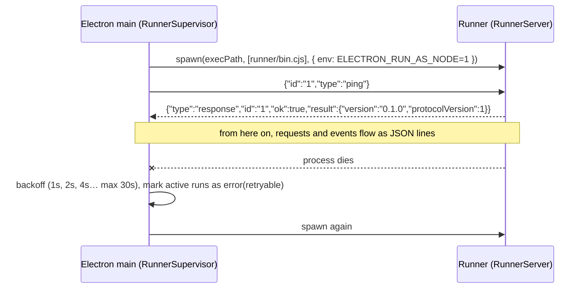

# Comitiva — Technical Design

> `SPEC.md` says **what**; this document says **how**: step-by-step bootstrapping, file layout, data model, main classes and methods, flows, commands. It is written to be read by Claude Code together with `SPEC.md`; phase prompts should reference it.
>
> Signatures are skeletons: names and responsibilities matter, implementation details are left to each phase.

---

## 1. How to bootstrap the project (Phase 0, step by step)

### 1.1 Prerequisites

| Tool | Version | Why |
|---|---|---|
| Node.js | 24 (`.nvmrc`; packages support ≥ 22) | same Node as Electron 44, which runs the runner in the app |
| pnpm | 10 (pinned in `packageManager`, via corepack) | workspaces (pnpm 12 does not honor the hoisted linker, ADR 0006) |
| Git | any | |
| Python 3 + build tools (Xcode CLT / VS Build Tools / `build-essential`) | | compile `better-sqlite3` |
| Claude Code, Codex CLI | optional | test harnesses in Phase 2 |

### 1.2 Command sequence

The Phase 0 bootstrap as it was actually done (the history is in git):

```bash
# 1. Repository and workspace
git init && corepack enable
cat > pnpm-workspace.yaml <<'EOF2'
packages:
  - packages/*
  - apps/*
nodeLinker: hoisted            # electron-builder and native modules prefer hoisted
onlyBuiltDependencies: [better-sqlite3, electron, esbuild]
ignoredBuiltDependencies: [electron-winstaller]
EOF2
mkdir -p packages/{contract,runner,mcp-servers} apps/desktop docs/adr

# 2. Root tooling (versions pinned per ADR 0006)
pnpm add -Dw typescript@~6.0 turbo eslint@^10 prettier @eslint/js typescript-eslint \
  eslint-config-prettier eslint-plugin-react-hooks globals vitest @types/node

# 3. contract
pnpm --filter @comitiva/contract add zod@^4 && pnpm --filter @comitiva/contract add -D tsup tsx

# 4. runner (the MCP SDK joins in Phase 5; openai, @google/genai and msw joined in Phase 1)
pnpm --filter @comitiva/runner add @anthropic-ai/sdk openai @google/genai pino zod@^4
pnpm --filter @comitiva/runner add -D tsup tsx msw

# 5. mcp-servers (scaffold only in Phase 0)
pnpm --filter @comitiva/mcp-servers add -D tsup

# 6. desktop (electron-vite layout written by hand; no scaffolder)
cd apps/desktop
pnpm add better-sqlite3
pnpm add -D electron@44.4.2 electron-vite@^5 vite@^7 @vitejs/plugin-react@^5 react@^19 react-dom@^19 \
  @types/react @types/react-dom tailwindcss@^4 @tailwindcss/vite@^4 zustand i18next react-i18next \
  drizzle-orm drizzle-kit ulid @types/better-sqlite3 electron-builder @playwright/test \
  @comitiva/contract@workspace:* @comitiva/runner@workspace:*
```

No `electron-rebuild` step: better-sqlite3 13 is N-API, so the same binary loads in Node (tests) and Electron (app). electron-builder rebuilds or fetches native modules when packaging.

### 1.3 Root configuration files

`package.json` (root):

```json
{
  "name": "comitiva",
  "private": true,
  "scripts": {
    "dev": "turbo run dev --filter=desktop",
    "build": "turbo run build",
    "lint": "turbo run lint",
    "typecheck": "turbo run typecheck",
    "test": "turbo run test",
    "format": "prettier --write .",
    "format:check": "prettier --check .",
    "contract:schema": "pnpm --filter @comitiva/contract run schema",
    "runner:dev": "pnpm --filter @comitiva/runner run dev",
    "package": "turbo run build --filter=desktop... && pnpm --filter desktop run package"
  }
}
```

`turbo.json`:

```json
{
  "$schema": "https://turbo.build/schema.json",
  "envMode": "loose",
  "tasks": {
    "build": { "dependsOn": ["^build"], "outputs": ["dist/**", "out/**"] },
    "dev": { "cache": false, "persistent": true, "dependsOn": ["^build"] },
    "lint": { "dependsOn": ["^build"] },
    "typecheck": { "dependsOn": ["^build"] },
    "test": { "dependsOn": ["^build"] }
  }
}
```

`tsconfig.base.json` (extended by every package):

```json
{
  "compilerOptions": {
    "target": "ES2022", "module": "ESNext", "moduleResolution": "Bundler",
    "strict": true, "noUncheckedIndexedAccess": true, "exactOptionalPropertyTypes": true,
    "skipLibCheck": true, "esModuleInterop": true, "resolveJsonModule": true, "isolatedModules": true
  }
}
```

`envMode: loose` is deliberate: strict mode hid `DBUS_SESSION_BUS_ADDRESS`/`XDG_*` from `pnpm dev`, which broke `safeStorage` on Linux. `schema/**` is not a build output; it is generated by `pnpm contract:schema` and committed.

The real `tsconfig.base.json` also sets `lib: ["ES2023"]`, `verbatimModuleSyntax`, `noImplicitOverride` and `forceConsistentCasingInFileNames`. Each package extends it and adds `"types": ["node"]` (TS 6 no longer includes `@types/*` automatically). Libraries build JS with tsup and declarations with `tsc -p tsconfig.build.json` (tsup's DTS step is incompatible with TS 6).

Build order: `contract` → `runner` and `mcp-servers` → `desktop`. `turbo` resolves this through `dependsOn: ["^build"]`.

### 1.4 Package names

| Directory | `name` | Publishable |
|---|---|---|
| packages/contract | `@comitiva/contract` | yes (the Laravel hub consumes `schema/`; subpath `./ipc-channels` has no zod) |
| packages/runner | `@comitiva/runner` | yes (bin `comitiva-runner` = `dist/bin.cjs`; subpaths `./bin`, `./testing`) |
| packages/mcp-servers | `@comitiva/mcp-servers` | yes (bins `comitiva-mcp-filesystem` (P5), `comitiva-mcp-gdrive` (P5b); none yet) |
| apps/desktop | `desktop` | no |

### 1.5 Phase 0 exit checklist

- [x] `pnpm lint && pnpm typecheck && pnpm test` green
- [x] `pnpm dev` opens a window; `app.getVersion` returns the version via IPC (through `Backend.app.getVersion()`)
- [x] runner starts as a child process and answers `ping`
- [x] spike: two Anthropic responses streaming simultaneously, independent cancel (e2e against a fake provider; real key pending, see STATUS). The spike was removed in Phase 1; parallel streams and cancel are covered by the runner integration tests.
- [x] runner event → paint latency measured and recorded in `docs/STATUS.md`
- [x] ADRs: ORM, license, runner execution, canonical block format (plus JSON Schema, toolchain)
- [ ] CI green on mac/win/linux (workflow written and replayed locally; the repo has no remote yet)

---

## 2. File layout

Files marked *(Pn)* arrive in phase n; everything else exists as of Phase 0.

```
packages/contract/src/
├── index.ts
├── common.ts          Id, IsoDate
├── entities/          connection.ts agent.ts conversation.ts message.ts tool-server.ts
│                      tool-approval.ts usage-record.ts usage-policy.ts
├── blocks.ts          Block = TextBlock | ImageBlock | DocumentBlock | ToolUseBlock | ToolResultBlock
├── provider-config.ts ProviderId, per-provider config schemas (Connection is a union on `provider`)
├── providers.ts       providerDescriptors: capabilities, key requirement, base URL, presets (plain data, P1)
├── errors.ts          ErrorCode, AppErrorShape, AppError
├── runner-protocol.ts RunnerRequest, RunnerEvent, results (PingResult, TestResult, …), PROTOCOL_VERSION
├── ipc.ts             desktop IPC contract (channels + input/output schemas, DesktopApi, IpcResult;
│                      ConnectionDraft/Probe/Patch/Target/Summary, SecretStorageStatus)
├── ipc-channels.ts    channel names only (no zod) for the sandboxed preload
└── schema.ts          zod → JSON Schema; scripts/write-schema.ts writes ../schema/*.json

packages/runner/src/
├── bin.ts             entry: new RunnerServer({ input: stdin, output: stdout }).start()
├── index.ts           public API: RunnerClient
├── version.ts
├── server/            RunnerServer.ts Transport.ts RequestRouter.ts
├── runs/              RunManager.ts Run.ts            ToolLoop.ts PermissionGate.ts (P5)
├── providers/         ProviderRegistry.ts (+ createDefaultRegistry) ProviderAdapter.ts
│   ├── api/           shared.ts AnthropicAdapter.ts OpenAICompatibleAdapter.ts GoogleAdapter.ts OllamaAdapter.ts
│   └── cli/           CliHarnessAdapter.ts ClaudeCodeAdapter.ts CodexAdapter.ts process.ts locateBinary.ts
│                      prompt.ts parsers/ (claudeCode.ts codex.ts types.ts) (P2)
├── mcp/               McpClientManager.ts McpClient.ts ToolCatalog.ts (P5)
├── usage/             UsageCalculator.ts pricing.json Tokenizer.ts (P6)
├── client/            RunnerClient.ts        (embedded by shells)
├── testing/           fakeProviders.ts fixtures.ts  (exported as @comitiva/runner/testing)
│                      fakeHarness.ts → dist/testing/bin/fake-claude, fake-codex (P2)
└── util/              jsonl.ts errors.ts logger.ts
packages/runner/test/fixtures/{claude-code,codex}/   recorded harness output (scrubbed), P2

packages/mcp-servers/src/            index.ts (scaffold)
├── filesystem/        server.ts RootGuard.ts tools/*.ts approval.ts (P5)
└── google-drive/      server.ts drive-api.ts tools/*.ts (P5b)

apps/desktop/
├── electron.vite.config.ts electron-builder.yml drizzle.config.ts playwright.config.ts
├── e2e/connections.spec.ts cli-connections.spec.ts (P2) agents.spec.ts (P3) chat.spec.ts (P4)
└── src/
    ├── main/
    │   ├── index.ts                 bootstrap: app.whenReady → Database → SecretStore → RunnerSupervisor → IpcRouter → window
    │   ├── paths.ts                 runner entry, migrations, userData files (dev vs packaged)
    │   ├── runner/                  RunnerSupervisor.ts RotatingLog.ts
    │   ├── db/                      schema.ts Database.ts migrations/ (0000_init, 0001_connection_last_test,
    │   │                            0002_agent_settings (P3), 0003_chat (P4), meta/)
    │   │                            repositories/ConnectionRepository.ts (P1) AgentRepository.ts SettingsRepository.ts (P3)
    │   │                            ConversationRepository.ts MessageRepository.ts UsageRepository.ts (P4; others P5+)
    │   ├── secrets/                 SecretStore.ts ElectronSecretStore.ts
    │   ├── services/                ConnectionService.ts (P1) workingDirectory.ts (P2) AgentService.ts (P3)
    │   │                            ConversationService.ts TitleService.ts (P4)
    │   │                            ToolServerService.ts ApprovalService.ts UsageService.ts (P5+)
    │   ├── ipc/                     IpcRouter.ts invoke.ts (runInvoke: validate in, strip out)
    │   └── oauth/                   GoogleOAuth.ts (P5b)
    ├── preload/index.ts             exposes the typed, allowlisted window.api (DesktopApi from contract/ipc.ts)
    └── renderer/
        ├── index.html               CSP
        └── src/
            ├── backend/             Backend.ts LocalBackend.ts (RemoteBackend.ts in Phase 8)
            ├── store/               app.ts connections.ts context.tsx (P1)   agents.ts (P3)   conversations.ts messages.ts (P4)
            ├── lib/                 connectionForm.ts cliConnectionForm.ts (P2) time.ts
            │                        agentForm.ts roleTemplates.ts async.ts (P3)   chat.ts (P4)
            ├── components/          ui.ts ProviderIcon.tsx ConfirmDialog.tsx Sidebar/ Forms/ConnectionForm.tsx (P1)
            │                        Forms/CliConnectionForm.tsx Forms/FormShell.tsx (P2)
            │                        AgentAvatar.tsx AgentPanel.tsx Sidebar/AgentList.tsx Forms/AgentForm.tsx (P3)
            │                        Chat/ (ChatView ConversationList MessageList MessageBubble Markdown StatusDot)
            │                        Composer/Composer.tsx ToolBlock/ToolCallBlock.tsx (P4)
            │                        ApprovalCard/ Settings/ (P5+)
            ├── screens/             ConnectionsScreen PlaceholderScreen (P1)   AgentsScreen (P3)
            │                        ToolsScreen UsageScreen SettingsScreen (P5+; chat lives in AgentsScreen)
            └── i18n/                index.ts en.json pt-BR.json
```

---

## 3. Data model

### 3.1 Diagram

```mermaid
erDiagram
    CONNECTION ||--o{ AGENT : "uses"
    AGENT ||--o{ CONVERSATION : "has"
    CONVERSATION ||--o{ MESSAGE : "contains"
    AGENT }o--o{ TOOL_SERVER : "enables (agent_tool_server)"
    AGENT ||--o{ AGENT_ROOT : "roots"
    CONVERSATION ||--o{ TOOL_APPROVAL : "approvals"
    MESSAGE ||--o{ USAGE_RECORD : "generates"
    CONNECTION ||--o{ USAGE_RECORD : "consumption"
    CONNECTION ||--o| USAGE_POLICY : "limit (Phase 10)"

    CONNECTION { text id PK; text name; text kind; text provider; json config; text secret_ref; int enabled; text created_at; text updated_at; text last_test_at; int last_test_ok; int last_test_latency_ms; text last_test_error_code }
    AGENT { text id PK; text name; json avatar; text connection_id FK; text model; text role; json params; text permission_policy; json fallback_connection_ids; json tags; text created_at; text updated_at }
    AGENT_ROOT { text agent_id FK; text path; text mode; int position }
    APP_SETTINGS { text key PK; json value }
    TOOL_SERVER { text id PK; text name; text transport; text command; json args; json env; text url; json headers; int builtin; int enabled }
    CONVERSATION { text id PK; text agent_id FK; text title; text status; text harness_session_id; int archived; text last_activity_at; text created_at }
    MESSAGE { text id PK; text conversation_id FK; text role; json content; text status; int seq; text created_at }
    TOOL_APPROVAL { text id PK; text conversation_id FK; text agent_id; text tool_server_id; text tool_name; text tool_use_id; json input; text decision; text decided_at }
    USAGE_RECORD { text id PK; text connection_id FK; text agent_id; text conversation_id; text message_id; text model; int input_tokens; int output_tokens; int cache_read_tokens; int cache_write_tokens; int estimated; real cost_usd; int latency_ms; text created_at }
    USAGE_POLICY { text connection_id PK; int max_tokens_day; real max_cost_day; int max_concurrent; text window_start; text window_end }
```

### 3.2 Initial DDL (SQLite, migration 0000_init)

The source of truth is the Drizzle schema in `apps/desktop/src/main/db/schema.ts` (ADR 0003). `drizzle-kit generate` produces `migrations/0000_init.sql`, which is equivalent to the DDL below except for the last table: Drizzle tracks applied migrations in `__drizzle_migrations`, not `schema_migrations`. Booleans are INTEGER, and JSON columns are TEXT with `'[]'`/`'{}'` defaults.

```sql
CREATE TABLE connections (
  id TEXT PRIMARY KEY, name TEXT NOT NULL, kind TEXT NOT NULL CHECK (kind IN ('api','cli')),
  provider TEXT NOT NULL, config TEXT NOT NULL DEFAULT '{}', secret_ref TEXT,
  enabled INTEGER NOT NULL DEFAULT 1, created_at TEXT NOT NULL, updated_at TEXT NOT NULL
);
-- 0001_connection_last_test (Phase 1): outcome of the last "Test connection", cleared when config or key change
ALTER TABLE connections ADD last_test_at TEXT;
ALTER TABLE connections ADD last_test_ok INTEGER;
ALTER TABLE connections ADD last_test_latency_ms INTEGER;
ALTER TABLE connections ADD last_test_error_code TEXT;

CREATE TABLE tool_servers (
  id TEXT PRIMARY KEY, name TEXT NOT NULL, transport TEXT NOT NULL CHECK (transport IN ('stdio','http')),
  command TEXT, args TEXT NOT NULL DEFAULT '[]', env TEXT NOT NULL DEFAULT '{}',
  url TEXT, headers TEXT NOT NULL DEFAULT '{}', builtin INTEGER NOT NULL DEFAULT 0,
  enabled INTEGER NOT NULL DEFAULT 1, created_at TEXT NOT NULL
);

CREATE TABLE agents (
  id TEXT PRIMARY KEY, name TEXT NOT NULL, avatar TEXT NOT NULL,
  connection_id TEXT NOT NULL REFERENCES connections(id) ON DELETE RESTRICT,
  model TEXT, role TEXT NOT NULL DEFAULT '', params TEXT NOT NULL DEFAULT '{}',
  permission_policy TEXT NOT NULL DEFAULT 'ask',
  fallback_connection_ids TEXT NOT NULL DEFAULT '[]', tags TEXT NOT NULL DEFAULT '[]',
  created_at TEXT NOT NULL, updated_at TEXT NOT NULL
);
CREATE INDEX idx_agents_connection ON agents(connection_id);

CREATE TABLE agent_roots (
  agent_id TEXT NOT NULL REFERENCES agents(id) ON DELETE CASCADE,
  path TEXT NOT NULL, mode TEXT NOT NULL CHECK (mode IN ('read','readwrite')),
  PRIMARY KEY (agent_id, path)
);
-- 0002_agent_settings (Phase 3): roots keep the user's order (the first readwrite root is a
-- harness's working directory), and app-wide preferences (AppSettings) get a key/value table.
ALTER TABLE agent_roots ADD position INTEGER NOT NULL DEFAULT 0;
CREATE TABLE app_settings (key TEXT PRIMARY KEY, value TEXT NOT NULL);   -- value is JSON

CREATE TABLE agent_tool_servers (
  agent_id TEXT NOT NULL REFERENCES agents(id) ON DELETE CASCADE,
  tool_server_id TEXT NOT NULL REFERENCES tool_servers(id) ON DELETE CASCADE,
  PRIMARY KEY (agent_id, tool_server_id)
);

CREATE TABLE conversations (
  id TEXT PRIMARY KEY, agent_id TEXT NOT NULL REFERENCES agents(id) ON DELETE CASCADE,
  title TEXT, status TEXT NOT NULL DEFAULT 'idle',
  harness_session_id TEXT, archived INTEGER NOT NULL DEFAULT 0,
  last_activity_at TEXT NOT NULL, created_at TEXT NOT NULL
);
CREATE INDEX idx_conversations_agent ON conversations(agent_id, archived, last_activity_at DESC);

CREATE TABLE messages (
  id TEXT PRIMARY KEY, conversation_id TEXT NOT NULL REFERENCES conversations(id) ON DELETE CASCADE,
  role TEXT NOT NULL CHECK (role IN ('user','assistant','tool')),
  content TEXT NOT NULL DEFAULT '[]', status TEXT NOT NULL DEFAULT 'complete',
  seq INTEGER NOT NULL, created_at TEXT NOT NULL
);
CREATE UNIQUE INDEX idx_messages_conv_seq ON messages(conversation_id, seq);
-- 0003_chat (Phase 4): why a reply failed (AppErrorShape JSON); which connection the harness
-- session belongs to (a session is resumed only on that connection); unread replies are those
-- with seq > last_read_seq.
ALTER TABLE messages ADD error TEXT;
ALTER TABLE conversations ADD harness_connection_id TEXT;
ALTER TABLE conversations ADD last_read_seq INTEGER NOT NULL DEFAULT 0;

CREATE TABLE tool_approvals (
  id TEXT PRIMARY KEY, conversation_id TEXT NOT NULL REFERENCES conversations(id) ON DELETE CASCADE,
  agent_id TEXT NOT NULL, tool_server_id TEXT NOT NULL, tool_name TEXT NOT NULL,
  tool_use_id TEXT NOT NULL, input TEXT NOT NULL,
  decision TEXT NOT NULL CHECK (decision IN ('allow','deny','allow-always')), decided_at TEXT NOT NULL
);
CREATE INDEX idx_approvals_always ON tool_approvals(agent_id, tool_server_id, tool_name) WHERE decision = 'allow-always';

CREATE TABLE usage_records (
  id TEXT PRIMARY KEY, connection_id TEXT NOT NULL, agent_id TEXT NOT NULL,
  conversation_id TEXT NOT NULL, message_id TEXT, model TEXT NOT NULL,
  input_tokens INTEGER, output_tokens INTEGER, cache_read_tokens INTEGER, cache_write_tokens INTEGER,
  estimated INTEGER NOT NULL DEFAULT 0, cost_usd REAL, latency_ms INTEGER, created_at TEXT NOT NULL
);
CREATE INDEX idx_usage_conn_time ON usage_records(connection_id, created_at);
CREATE INDEX idx_usage_agent_time ON usage_records(agent_id, created_at);

-- applied migrations are tracked by Drizzle in __drizzle_migrations
```

`agents.avatar` holds JSON `AgentAvatar` (`{ color, emoji? }`: a palette color name, and an optional emoji; without one the UI shows the name's initials). The column stayed TEXT, so no DDL change was needed.

Conventions: ids are ULIDs (sortable); dates are ISO 8601 UTC; JSON in TEXT columns is validated by zod on read and write; `seq` in `messages` is incremented per conversation and is used for ordering and for reconciliation with the hub.

### 3.3 Message blocks (canonical)

```ts
type Block =
  | { type: 'text'; text: string }
  | { type: 'image'; source: { kind: 'base64'; mediaType: string; data: string } | { kind: 'file'; path: string } }
  | { type: 'document'; name: string; mediaType: string; source: /* same */ }
  | { type: 'tool_use'; id: string; toolServerId: string; name: string; input: unknown }
  | { type: 'tool_result'; toolUseId: string; content: Array<TextBlock | ImageBlock | DocumentBlock>; isError: boolean; durationMs?: number };
```

`tool_result.content` cannot nest `tool_use`/`tool_result`, the same restriction as the Anthropic API (ADR 0004).

An `assistant` message can mix `text` and `tool_use`; the following `tool` message carries the `tool_result`s. Adapters translate to the provider's format (OpenAI uses `tool_calls`/`role: tool`; Gemini uses `functionCall`/`functionResponse`).

---

## 4. Runner

### 4.1 Lifecycle



### 4.2 Classes

```ts
// server/Transport.ts — JSON lines over streams
class JsonLinesTransport {
  constructor(input: NodeJS.ReadableStream, output: NodeJS.WritableStream);
  onMessage(handler: (msg: unknown) => void): void;
  onMalformed(handler: (line: string) => void): void;   // non-JSON line → the server answers with a `log` event
  onClose(handler: () => void): void;                   // stdin ended → the server stops
  send(msg: RunnerEvent): void;        // serializes + '\n'; never throws
}

// server/RunnerServer.ts
class RunnerServer {
  constructor(opts: { input: ReadableStream; output: WritableStream; logger?; registry?: ProviderRegistry; onExit?: () => void });
  // builds JsonLinesTransport, RunManager and RequestRouter itself; McpClientManager joins in Phase 5
  start(): void;                        // validates each line with the RunnerRequest schema, dispatches to RequestRouter
  stop(): Promise<void>;                // idempotent: cancels runs (closes MCP clients from P5), then onExit
}

// server/RequestRouter.ts
class RequestRouter {
  handle(req: RunnerRequest): Promise<unknown>;   // switch on req.type → matching method
  // connection.test → registry.get(provider).testConnection
  // connection.listModels → registry.get(provider).listModels
  // cli.detect → (registry.get(provider) as CliHarnessAdapter).detect(binaryPath)   (P2)
  // toolServer.start/stop → mcp.start/stop
  // run.start → runs.start ; run.cancel → runs.cancel ; run.approval → runs.resolveApproval
}

// runs/RunManager.ts — one Run per runId, all concurrent
class RunManager {
  constructor(registry: ProviderRegistry, emit: (e: RunEvent) => void, logger: Logger);
  start(req: RunStartRequest): void;                 // creates Run, does not block; duplicate runId → invalid_request
  cancel(runId: string): boolean;                    // AbortController.abort(); idempotent, false if unknown
  cancelAll(timeoutMs?: number): Promise<void>;      // on shutdown / stdin close
  resolveApproval(runId: string, toolUseId: string, decision: ApprovalDecision): void;
  active(): string[];
}

// runs/Run.ts — Phase 0 takes (req, adapter, emit, logger); tools and gate join in Phase 5
class Run {
  constructor(req: RunStartRequest, adapter: ProviderAdapter, tools: ToolCatalog, gate: PermissionGate, emit: (e: RunnerEvent) => void);
  execute(): Promise<void>;
  // guarantees exactly one terminal event (run.done | run.error) and nothing after it; stamps runId + ts
  // model = agent.model ?? connection.config.defaultModel, else invalid_request
  // builds RunInput, creates RunContext { tools, callTool }, iterates adapter.run(...)
  // translates AdapterEvent → RunnerEvent with runId; measures latency; collects usage
  private callTool(toolUseId: string, name: string, input: unknown): Promise<ToolResult>;
  // → gate.check(...) → if approval is needed, emits run.tool_call{requiresApproval:true} and awaits a promise
  // → tools.call(...) → emits run.tool_result
}

// runs/ToolLoop.ts — used by the API adapters (Phase 5; the Phase 0 Anthropic adapter streams one turn)
async function* toolLoop(opts: {
  callModel: (messages: Message[], tools: ToolDef[], signal: AbortSignal) => AsyncIterable<AdapterEvent>;
  ctx: RunContext; messages: Message[]; maxIterations: number; signal: AbortSignal;
}): AsyncIterable<AdapterEvent>
// loop: call model → accumulate tool_use → for each, ctx.callTool → append tool_result → repeat until stopReason != 'tool_use'

// runs/PermissionGate.ts
class PermissionGate {
  constructor(policy: PermissionPolicy, alwaysAllowed: Set<string> /* `${serverId}:${tool}` */);
  check(tool: ToolDef): 'allow' | 'ask' | 'deny';
  // read-only (annotations.readOnlyHint) → allow
  // policy read-only + tool not read-only → deny
  // allow-always recorded → allow ; policy allow-writes → allow ; otherwise ask
}
```

```ts
// providers/ProviderAdapter.ts
interface ProviderAdapter {
  readonly id: ProviderId;
  readonly kind: 'api' | 'cli';
  readonly capabilities: Capabilities;
  testConnection(connection: Connection, secret?: string): Promise<TestResult>;
  listModels?(connection: Connection, secret?: string): Promise<ModelInfo[]>;
  run(input: RunInput, ctx: RunContext, signal: AbortSignal): AsyncIterable<AdapterEvent>;
}

interface RunContext {
  tools: ToolDef[];                                            // aggregated from the agent's servers
  callTool(toolUseId: string, name: string, input: unknown): Promise<ToolResult>;
  mcpConfigForCli?(): Promise<{ path: string; cleanup(): void }>; // temporary file for harnesses (P2)
  log(level: 'debug' | 'info' | 'warn', msg: string): void;
}

// providers/ProviderRegistry.ts
class ProviderRegistry {
  register(adapter: ProviderAdapter): void;
  get(id: ProviderId): ProviderAdapter;                        // throws AppError('unknown_provider')
  list(): RegisteredProvider[];                                // { id, kind, capabilities }
}
function createDefaultRegistry(): ProviderRegistry;            // four API adapters + Claude Code + Codex; RunnerServer's default
// Form metadata (label, key requirement, base URL, presets) is static data in
// @comitiva/contract (`providerDescriptors`), so shells build forms without the runner;
// adapters take `capabilities` from there. How to add one: docs/providers.md.

// providers/api/shared.ts — the rules every API adapter follows (CLI adapters reuse streamTurn, UsageTracker and httpError)
function streamTurn(opts: { signal; usage: UsageTracker; toAppError; body: () => AsyncGenerator<AdapterEvent, StopReason> }): AsyncIterable<AdapterEvent>;
// one run.usage then run.done; abort → usage so far (estimated) + done(cancelled) at once, even if the SDK hangs
class UsageTracker { static for(input): UsageTracker; addText(t); report({ input?, output?, cacheRead?, cacheWrite?, final? }); event() }
function httpError(status, message, cause?): AppError;        // 401/403 auth_failed, 429 rate_limited, 5xx provider_unavailable, 4xx provider_error
function networkError(err): AppError;                          // refused/DNS → provider_unavailable, timeout → timeout (both retryable)
function withDeadline<T>(fn: (signal) => Promise<T>, toAppError, ms = 15000): Promise<T>;   // listModels
function probe(fn, toAppError, ms = 15000): Promise<TestResult>;                            // testConnection, never throws

// providers/api/AnthropicAdapter.ts (OpenAICompatibleAdapter, GoogleAdapter and OllamaAdapter follow the same shape)
class AnthropicAdapter implements ProviderAdapter {
  private client(config, secret): Anthropic;
  private toProviderMessages(messages: Message[]): MessageParam[];   // Block[] → Anthropic format
  private toProviderTools(tools: ToolDef[]): Tool[];
  run(input, ctx, signal) { return toolLoop({ callModel: (m, t, s) => this.stream(m, t, s), ... }); }
  private async *stream(...): AsyncIterable<AdapterEvent>;          // SDK stream → text_delta/tool_use/usage/done
  // apiKey and base URL are always explicit (never ambient env); errors → auth_failed | rate_limited |
  // provider_unavailable | provider_error | timeout; abort → usage (estimated if no message_delta yet) + done(cancelled)
}
// OpenAICompatibleAdapter: openai SDK, Chat Completions + stream_options.include_usage; key optional
//   (no Authorization header without one); OpenAI preset sends max_completion_tokens.
// GoogleAdapter: @google/genai (Gemini API keys, not Vertex), generateContentStream, thinking tokens count as output;
//   400 API_KEY_INVALID → auth_failed.
// OllamaAdapter: fetch /api/chat (NDJSON), /api/tags, /api/version; optional bearer key.
// Phase 1 adapters other than Anthropic are text-only: image and tool blocks → unsupported_content.

// providers/cli/CliHarnessAdapter.ts — one child process per turn (ADR 0007, docs/providers.md → CLI harnesses)
abstract class CliHarnessAdapter implements ProviderAdapter {
  kind = 'cli' as const;                                          // capabilities from cliProviderDescriptors
  constructor(options?: { env?; searchDirs?; idleTimeoutMs?; probeTimeoutMs? });
  protected abstract buildArgs(turn: TurnSpec): string[];         // TurnSpec { config, model ('' → harness default), system, resume, mcpConfigPath, probe }
  protected abstract createParser(opts: { usage; log; idPrefix }): HarnessParser;
  protected abstract authCheck(bin, env, cwd): Promise<void>;     // throws not_logged_in
  protected preflight(bin, env, cwd, connection): Promise<void>;  // Codex: sandbox probe → sandbox_unavailable
  detect(binaryPath?): Promise<CliDetectResult>;                  // locateBinary + --version (cli.detect)
  testConnection(connection): Promise<TestResult>;                // detect → auth → preflight → minimal prompt (90 s)
  run(input, ctx, signal);                                        // streamTurn around: mkdir cwd → mcpConfigForCli (P5) →
  // spawnHarness(prompt on stdin) → parser.push per line → parser.finish; lost session → one replay retry
}
interface HarnessParser {                                         // pure, tested against recorded fixtures
  push(line: unknown): AdapterEvent[];
  finish(exit, stderr): StopReason;                               // or throws the mapped AppError
  sessionNotFound(stderr): boolean;
}
function spawnHarness(bin, args, { cwd, env, stdin, signal, idleTimeoutMs }): HarnessProcess;
// { lines, exited, stderrTail(), kill() }: own process group (POSIX), SIGTERM then SIGKILL, idle timeout → timeout
function locateBinary({ name, label, explicit?, env?, extraDirs? }): Promise<string>;   // binary_not_found with where it looked
function buildPrompt(messages, resume: boolean): string;          // resume → last user message; else transcript + new message
function harnessEnv(base): NodeJS.ProcessEnv;                     // drops ELECTRON_RUN_AS_NODE, COMITIVA_*, provider keys
class ClaudeCodeAdapter extends CliHarnessAdapter { /* -p --output-format stream-json --verbose --include-partial-messages
  --permission-mode bypassPermissions --setting-sources "" --strict-mcp-config [--model] [--append-system-prompt] [--resume] */ }
class CodexAdapter extends CliHarnessAdapter { /* exec [resume] --json --skip-git-repo-check --ignore-user-config
  -c sandbox_mode=… [-m] [-c developer_instructions=…] … [<thread_id>] - */ }
```

```ts
// mcp/McpClientManager.ts
class McpClientManager {
  start(server: ToolServer, secrets: Record<string, string>): Promise<ToolDef[]>;  // idempotent
  stop(serverId: string): Promise<void>;
  catalogFor(serverIds: string[]): ToolCatalog;
  private restartOnFailure(serverId: string): void;
}

// mcp/ToolCatalog.ts — aggregated view for a run
class ToolCatalog {
  defs(): ToolDef[];                                            // prefixed names: `${serverSlug}__${tool}` to avoid collisions
  call(name: string, input: unknown, signal: AbortSignal): Promise<ToolResult>;
  resolve(name: string): { serverId: string; tool: ToolDef };
}

// usage/UsageCalculator.ts
class UsageCalculator {
  constructor(pricing: PricingTable, overrides?: PricingTable);
  cost(model: string, usage: TokenUsage): number | null;
  estimate(messages: Message[], output: string): TokenUsage;   // approximate fallback, estimated=true
}

// client/RunnerClient.ts — what shells embed
class RunnerClient extends EventEmitter {
  constructor(opts: { spawn: () => ChildProcess; requestTimeoutMs?: number });
  start(): Promise<PingResult>;                                 // spawn + ping; call again after 'crash' to restart
  request<T>(req: Omit<RunnerRequest, 'id'>): Promise<T>;       // correlates by id; AppError on failure
  startRun(req: RunStartPayload): { runId: string };            // returns at once; start failures arrive as run.error
  cancelRun(runId: string): void;
  approve(runId: string, toolUseId: string, decision: ApprovalDecision): void;
  testConnection(req): Promise<TestResult>;                     // provider failures come back as { ok: false }
  listModels(req): Promise<ModelInfo[]>;                        // rejects with the provider's AppError
  detectCli(req): Promise<CliDetectResult>;                     // cli.detect; rejects with binary_not_found (P2)
  // request(payload, { timeoutMs? }): CLI connection tests use 120 s (a real prompt with a cold start)
  activeRunIds(): string[];
  on(event: 'run.event', h: (e: RunEvent & { receivedAt: number }) => void): this;
  on(event: 'log', h: (e: LogEvent) => void): this;
  on(event: 'crash', h: (code: number | null, signal) => void): this;   // active runs already got run.error(runner_crashed)
  on(event: 'exit', h: () => void): this;                               // after stop()
  stop(): Promise<void>;                                        // shutdown request, SIGKILL after timeout
}
```

### 4.3 Flow of a turn with a tool and approval

```mermaid
sequenceDiagram
    actor U as User
    participant UI as Renderer
    participant CS as ConversationService (main)
    participant RC as RunnerClient
    participant R as Run (runner)
    participant A as Adapter (API)
    participant FS as MCP filesystem

    U->>UI: sends "reorganize the reports"
    UI->>CS: sendMessage(convId, blocks)
    CS->>CS: persists user msg; status=running
    CS->>RC: run.start {agent, connection, secret, messages, alwaysAllowed}
    RC->>R: JSON line
    R->>A: run(input, ctx)
    A-->>R: text_delta*
    R-->>CS: run.text_delta (batched in CS every ~50ms)
    CS-->>UI: stream
    A-->>R: tool_use fs__list_dir
    R->>R: gate.check → allow (read-only)
    R->>FS: tools/call list_dir
    FS-->>R: result
    R-->>CS: run.tool_call{requiresApproval:false}, run.tool_result
    A-->>R: tool_use fs__move
    R->>R: gate.check → ask
    R-->>CS: run.tool_call{requiresApproval:true}
    CS->>CS: status=awaiting-approval
    CS-->>UI: ApprovalCard
    U->>UI: "Always allow"
    UI->>CS: approve(convId, toolUseId, 'allow-always')
    CS->>CS: stores tool_approval
    CS->>RC: run.approval
    RC->>R: JSON line → promise resolved
    R->>FS: tools/call move
    FS-->>R: ok
    R-->>CS: run.tool_result
    A-->>R: text_delta* , done, usage
    R-->>CS: run.usage, run.done
    CS->>CS: persists assistant/tool msg, usage_record; status=idle
    CS-->>UI: done
```

Batching: `ConversationService` accumulates `text_delta` and writes to SQLite every ~250 ms or at the end of the run; to the UI, it forwards once per frame (16 ms, chosen from the Phase 0 measurements in `docs/STATUS.md`; 50 ms added ~35 ms of visible lag). Never one `UPDATE` per token and never one IPC message per token.

---

## 5. Built-in MCP servers

```ts
// mcp-servers/src/filesystem/RootGuard.ts
class RootGuard {
  constructor(roots: Array<{ path: string; mode: 'read' | 'readwrite' }>);
  resolve(requested: string, op: 'read' | 'write'): string;
  // realpath of the candidate AND of each root; requires realpath(candidate) to start with realpath(root) + sep
  // for write, requires a readwrite root; for paths that do not exist yet, validates the parent directory
  // throws OutsideRootsError / ReadOnlyRootError — never returns a path outside the roots
}

// mcp-servers/src/filesystem/server.ts — arguments: --root <path>:<mode> (repeatable)
// tools: list_dir, read_file, search (glob + content), write_file, create_dir, move, delete
// annotations: list_dir/read_file/search → readOnlyHint:true ; delete/move → destructiveHint:true
// approval: the server does NOT approve anything; the runner decides before calling tools/call (PermissionGate).
// For CLI harnesses that call the server directly, the server receives --approval-socket <path>
// and asks the runner over a local socket before executing writes (Phase 5, design to be confirmed).
```

```ts
// mcp-servers/src/google-drive/server.ts — tokens via env GDRIVE_ACCESS_TOKEN (refreshed by the desktop)
// tools: search, read (Docs → text/markdown, Sheets → CSV), create (doc/text), update, move
// analogous annotations
```

---

## 6. Desktop — main process

```ts
// main/runner/RunnerSupervisor.ts
class RunnerSupervisor extends EventEmitter<{ status: [RunnerStatus] }> {
  constructor(opts: { runnerEntry: string; logFile: string; command?: string; env?; backoff? });
  readonly client: RunnerClient;  // services subscribe to client 'run.event'
  status: 'starting' | 'ready' | 'restarting' | 'stopped';
  start(): Promise<void>;         // spawn process.execPath with ELECTRON_RUN_AS_NODE=1 (ADR 0002); stderr → RotatingLog
  private onCrash(): void;        // backoff 1s, 2s, 4s… 30s (reset after 30s stable); client already failed active runs
  stop(): Promise<void>;
}

// main/db/Database.ts
class Database {
  static open(path: string): Database;   // WAL, foreign_keys=ON, busy_timeout
  migrate(migrationsFolder: string): void; // Drizzle migrator; tracked in __drizzle_migrations
  transaction<T>(fn: () => T): T;
  raw: BetterSqlite3.Database;
  orm: BetterSQLite3Database<typeof schema>;
}

// main/db/repositories/*.ts — common pattern
interface Repository<T, Create, Update> {
  list(filter?): T[]; get(id): T | null; create(data: Create): T; update(id, data: Update): T; delete(id): void;
}
class ConnectionRepository {
  list(): ConnectionRecord[]; get(id); require(id) /* not_found */; create(NewConnection); update(id, changes);
  preview(current, changes): Connection;   // validated result without writing (lets the service validate before touching secrets)
  delete(id) /* connection_in_use while agents use it */; hasAgents(id); recordTest(id, TestResult);
  // ConnectionRecord = { connection, lastTest }; config validated by zod on read and write; only secret_ref stored
}
class AgentRepository {
  list(): Agent[]; get(id); require(id) /* not_found */; create(NewAgent); update(id, AgentChanges);
  duplicate(id, name); delete(id) /* roots, tool server links (and conversations) cascade */;
  // roots (ordered by position) and toolServerIds are loaded and saved together, in one transaction;
  // an unknown tool server or a repeated root → invalid_request. Every write is validated by the Agent schema.
  // Connection rule (create, duplicate, and updates that change connectionId or model): the connection must
  // exist (not_found) and be enabled (connection_disabled); an API connection needs agent.model or
  // config.defaultModel (model_required). Renaming an agent on a since-disabled connection still works.
  // alwaysAllowed(agentId) joins in Phase 5.
}
class SettingsRepository { get(): AppSettings /* defaults for missing or invalid keys */; update(patch) }
// ConnectionRepository.agentsUsing(id) → [{ id, name }]; delete's connection_in_use message names them.
class ConversationRepository {   // (P4)
  list({ agentId?, archived }): ConversationSummary[];   // newest activity first, with unread (seq > last_read_seq)
  get(id); require(id) /* not_found */; create(agentId, at?); rename(id, title | null); setArchived(id, archived);
  setStatus(id, status); touch(id, at?) /* lastActivityAt */; markRead(id);
  harnessSession(id, connectionId): string | undefined;   // only when the session belongs to that connection
  setHarnessSession(id, sessionId, connectionId);
  recoverInterrupted(): string[];   // at boot: running → error
}
class MessageRepository {        // (P4)
  page(conversationId, { beforeSeq?, limit }): { messages, hasMore };   // oldest first
  all(conversationId); last(conversationId); get(id); require(id);
  insert(conversationId, role, content, status, at);   // next seq in the same statement
  setContent(id, blocks) /* 250 ms checkpoints */; finish(id, status, blocks, error); reset(id) /* retry */;
  recoverInterrupted();   // at boot: streaming → error { interrupted }
}
class UsageRepository { insert(NewUsageRecord); listByConversation(id) }   // (P4; summary/timeseries in P6)
class ToolServerRepository, ToolApprovalRepository { /* P5 */ }

// main/secrets/SecretStore.ts
interface SecretStore {
  set(ref: string, value: string): Promise<void>;
  get(ref: string): Promise<string | null>;
  has(ref: string): Promise<boolean>;
  delete(ref: string): Promise<void>;
  status(): { available: boolean; weak: boolean };          // → IPC secrets.getStatus (UI banner)
}
class ElectronSecretStore implements SecretStore {
  constructor(filePath: string, crypto: SafeStorageLike, opts?: { allowWeak?: boolean });   // safeStorage injected (fake in tests)
  // safeStorage.encryptString → file <userData>/secrets.bin (JSON { version: 1, entries: { ref: base64 } }),
  // atomic write (tmp + rename, 0600), serialized
  // refuses to operate (secret_store_unavailable) if !safeStorage.isEncryptionAvailable()
  isWeak(): boolean;              // Linux basic_text backend
  // Without a keyring (basic_text) it refuses to store keys (secret_store_unavailable, SPEC §7) unless
  // allowWeak, which main sets only with COMITIVA_ALLOW_WEAK_SECRET_STORAGE=1 (tests/CI).
}

// main/services/ConnectionService.ts
class ConnectionService {
  constructor(deps: { repo: ConnectionRepository; secrets: SecretStore; runner: Pick<RunnerClient, 'testConnection' | 'listModels'> });
  list(): Promise<ConnectionSummary[]>;                  // { connection, hasSecret, lastTest }; never a key
  create(draft: ConnectionDraft): Promise<ConnectionSummary>;   // key → SecretStore under connection:<id>, validated first
  update(id, patch: ConnectionPatch): Promise<ConnectionSummary>; // apiKey: omitted keeps, string replaces, null removes
  delete(id): Promise<void>;                             // row + key
  test(target: ConnectionTarget): Promise<TestResult>;   // { id } recorded as lastTest; { probe } (+ id to reuse the stored key) is not
  listModels(target: ConnectionTarget): Promise<ModelInfo[]>;
  detectBinary(input: DetectBinaryInput): Promise<CliDetectResult>;   // CLI harnesses (P2); CLI connections never read or store a key
}
// main/services/AgentService.ts (P3) — thin over AgentRepository; agents.delete calls ConversationService.forgetAgent first
class AgentService {
  list(); create(draft: ValidAgentDraft); update(id, patch: ValidAgentPatch); delete(id);
  duplicate(id, name?);   // name comes localized from the UI; fallback "<name> (copy)"
}

function resolveWorkingDirectory(connection, conversationId, workspacesDir): string | undefined;
// services/workingDirectory.ts (P2): config.workingDirectory, else <userData>/workspaces/<conversationId>; used by ConversationService (P4)

// main/services/ConversationService.ts (P4)
class ConversationService extends EventEmitter<ConversationEvents> {
  constructor(deps: { db; conversations; messages; usage; agents; connections; secretFor(connection); runner: RunnerPort;
                      title: TitleService; workspacesDir; timing?: { uiFlushMs?; dbFlushMs?; cancelGraceMs? } });
  list(filter); create(agentId); rename(id, title); archive(id, archived); markRead(id);
  listMessages({ conversationId, beforeSeq?, limit }): MessagePage;   // flushes pending text; live reply at page.rev (ADR 0008)
  sendMessage(conversationId, content: UserContent): Promise<void>;
  // refuses before writing anything: conversation_busy, connection_disabled, model_required, secret_missing;
  // then user message + empty streaming reply + placeholder title + status running, in one transaction
  retryLast(conversationId): Promise<void>;   // last message must be a failed reply; reset in place
  cancel(conversationId): void;               // runner cancel; finalized locally as cancelled after a grace period
  forgetAgent(agentId): void;                 // before deleting an agent: stop its runs, write nothing
  recover(): void;                            // at boot (interrupted); shutdown(): cancels and finalizes every run
  // Runs: one per conversation at a time, no global queue. History = stored messages before the reply.
  // CLI: harnessSession(conversationId, connectionId) + resolveWorkingDirectory. run.session is persisted at once.
  // Text: coalesced to the UI every 16 ms, checkpointed to SQLite every ~250 ms. Terminal event: final message,
  // one usage record per run, status idle | error, touch, all in one transaction; after the first complete reply,
  // TitleService replaces the placeholder unless the user renamed it.
  // Events → IpcRouter.broadcast: conversation.updated, message.updated, message.delta, message.block (rev per conversation)
}

// main/services/TitleService.ts (P4)
placeholderTitle(content): string | null;   // first non-blank line, ≤ 60 chars; set on the first send
class TitleService {
  generate({ conversationId, agent, connection, user, reply }): Promise<string | null>;
  // a separate runner run with titleModelFor(provider, preset, model); API connections only; its usage is recorded
  // with messageId null; never throws (null → the placeholder stays)
}

// main/ipc/invoke.ts
function runInvoke(channel, rawInput, handler): Promise<IpcResult<Output>>;
// input.safeParse → handler → output.parse (strips unknown keys, so nothing outside the schema reaches the renderer)
// errors → { ok: false, error: AppErrorShape }. The envelope exists because custom Error props do not cross contextBridge.

// main/ipc/IpcRouter.ts
class IpcRouter {
  constructor(handlers: InvokeHandlers, isTrustedSender: (frameUrl: string) => boolean);
  register(): void;   // for each channel in contract ipcInvokeChannels: ipcMain.handle(channel, (e, input) => runInvoke(...))
  broadcast<C>(channel: C, payload: IpcEventPayload<C>): void;   // webContents.send to all windows
}
```

IPC channels (defined in `contract/ipc.ts`, all with input and output schemas; names also listed in `contract/ipc-channels.ts`). `invoke` resolves to `{ ok: true, value } | { ok: false, error }`, which `LocalBackend` unwraps into a `BackendError` with a `code`. `IpcInput<C>` is what the renderer sends (`z.input`: fields with defaults may be omitted); handlers receive `IpcParsedInput<C>` (`z.output`). `AgentDraft` applies defaults (role `''`, params `{}`, tags, roots, toolServerIds `[]`, policy `ask`) and turns a blank model into `null` (use the connection's default).

```
app.getVersion
runner.getStatus
secrets.getStatus                                                    (P1)
connections.list | create | update | delete | test | listModels     (P1)
connections.detectBinary                                            (P2)
toolServers.list | create | update | delete | test | connectGoogle (5b)
agents.list | create | update | delete | duplicate                   (P3)
settings.get | update                                               (P3; AppSettings, e.g. sampleAgentOffer)
conversations.list | create | rename | archive | markRead             (P4; list takes { agentId?, archived })
messages.list | send | cancel | retry                                (P4; list → { messages, hasMore, rev })
approvals.decide                                                    (P5)
usage.summary | timeseries | export
dialogs.pickFolder                                                  (P2)
events: runner.status (P0); conversation.updated, message.updated, message.delta, message.block (P4, ADR 0008);
        approval.requested (P5)
```

---

## 7. Desktop — renderer

```ts
// renderer/src/backend/Backend.ts — the UI only knows this
interface Backend {
  app: { getVersion() };
  runner: { getStatus() };
  secrets: { getStatus() };                                    // { available, weak }
  capabilities(): { cliHarnesses: boolean; localRoots: boolean; hub: boolean };   // (P2+)
  connections: { list(); create(draft); update(id, patch); delete(id); test(target); listModels(target); detectBinary(input) };
  dialogs: { pickFolder() };                                   // (P2) null when cancelled
  toolServers: { list(); create(d); update(id, d); delete(id); test(id) };
  agents: { list(); create(d); update(id, d); delete(id); duplicate(id, name?) };   // (P3)
  settings: { get(); update(patch) };                                               // (P3)
  conversations: { list(filter?); create(agentId); rename(id, t); archive(id, archived); markRead(id) };   // (P4)
  messages: { list(convId, { beforeSeq?, limit? }?); send(convId, UserContent); cancel(convId); retry(convId) };   // (P4)
  approvals: { decide(convId, toolUseId, decision) };
  usage: { summary(range, groupBy); timeseries(range) };
  onEvent(handler: (e: BackendEvent) => void): () => void;
}
class LocalBackend implements Backend { /* delegates to window.api; onEvent subscribes to the event channels */ }
// Phase 1 implements app, runner, secrets, connections and onEvent (runner.status); Phase 2 dialogs; Phase 3 agents and settings;
// Phase 4 conversations, messages and their events.

// renderer/src/store/*.ts (Zustand vanilla stores created with the Backend injected; StoresProvider + useApp/useConnections)
appStore:               version, runnerStatus (pushed status wins over init), secretStatus, section (sidebar navigation)
connectionsStore:       items: ConnectionSummary[], testing, editor (closed | create | edit id), confirmDelete, notice (error code)
agentsStore (P3):       items, selectedId, editor (closed | create with prefill | edit id), confirmDelete, notice,
                        models per connection (fetched once per session; retry forces), settings;
                        createSample (model_required → opens the prefilled form), dismissSample.
conversationsStore (P4): byId, idsByAgent / archivedIdsByAgent (newest activity first), selectedByAgent (undefined =
                        the most recent, null = "new conversation"), visibleId (on screen: its replies are read),
                        unread, notice; load, loadArchived, create, select, setVisible, rename, archive, forgetAgent.
                        Selectors: agentStatus (running > error > idle), agentUnread, isRunning — from main's status.
messagesStore (P4):     byConversation: { items, status, hasMore, loadingOlder, rev, buffered }, drafts, sending,
                        actionError; load (buffers events until the page is in), loadOlder, send, cancel, retry.
                        Events apply by rev (ADR 0008): stale dropped, next applied, a gap reloads the page.
uiStore (later):        rightPanelOpen, theme, quickSwitcherOpen, pendingApprovals (P5)
```

Phase 1 components: `Sidebar/Sidebar` (Agents placeholder, Connections/Tools/Usage/Settings, version and runner status), `screens/ConnectionsScreen`, `Forms/ConnectionForm` (built from `providerDescriptors`; its pure logic is `lib/connectionForm.ts`), `ProviderIcon` (monograms, no brand logos), `ConfirmDialog`.

Phase 2: `Forms/ConnectionForm` picks the API form or `Forms/CliConnectionForm` by provider. Both use `Forms/FormShell` (side panel, shared `ProviderSelect` with API and CLI groups, `TestOutcome`). The CLI form (pure logic in `lib/cliConnectionForm.ts`, built from `cliProviderDescriptors`) has binary path + Detect, working directory + Choose…, Codex sandbox, default model, extra args (one per line), an always-visible auto-accept notice, and the Codex native-tools warning. Test failures add a hint by code (login command, sandbox, binary).

Phase 3:
- `Sidebar/AgentList`: avatar, name, a status dot, and a warning when the connection is disabled or missing. The empty state says "Create agent", or "Add a connection first".
- `screens/AgentsScreen`:
  - center: the selected agent's chat (Phase 4), the first-run sample offer, or an empty state
  - right: `AgentPanel`, with the connection, model, params and tags, the role editable in place (Ctrl/Cmd+Enter saves, Esc cancels), and Edit / Duplicate / Delete
- `Forms/AgentForm` (pure logic in `lib/agentForm.ts`) has these fields:
  - avatar: color swatches, an emoji grid or a typed emoji, or initials
  - connection: `<optgroup>` API / CLI, enabled only, plus the current one
  - model: a datalist filled from `connections.listModels` when the provider supports it; free text for CLI
  - role, with starter templates from i18n (`lib/roleTemplates.ts`)
  - temperature and max tokens, hidden for CLI
  - tags as chips
- `FormShell` now takes `icon` and `title`.
- `AgentAvatar` maps palette names to light and dark classes.
- `ConfirmDialog` takes `blocked`: deleting a connection in use lists its agents and disables Delete.
- The app lands on Agents once at least one connection exists, unless the user already navigated.

Phase 4 (pure logic in `lib/chat.ts`):
- `AgentsScreen` center: `Chat/ConversationList` (new, rename in place, archive, show archived, status and unread per row) and `Chat/ChatView` (header, messages, composer). With no conversation open, the first send creates one and sends into it.
- `Chat/MessageList`: react-virtuoso. It follows the bottom while the user is there, including while a reply grows, and pages back at the top (`firstItemIndex` keeps the position).
- `Chat/MessageBubble`: Slack-style rows. User text is plain; replies are `Chat/Markdown` (react-markdown + remark-gfm, no raw HTML, code blocks with Copy, links opened by main in the system browser). It also shows the streaming cursor, "Stopped", and the error by code with Retry on the last failed reply.
- `ToolBlock/ToolCallBlock`: a collapsible tool call (name, state, arguments, result, duration), used today for harness tool calls.
- `Composer/Composer`: Enter sends, Shift+Enter adds a line (never while an IME composes), Stop while running, and the draft is kept per conversation. It is blocked with a reason when the agent's connection is disabled or missing.
- `Chat/StatusDot` for agents (sidebar) and conversations. The sidebar also shows an unread badge per agent.
- Deleting an agent says how many conversations go with it (archived ones included).

Later components: `ApprovalCard`, `QuickSwitcher` (Cmd/Ctrl+K), attachments in the composer (P7), `Forms/ToolServerForm`, the roots and tools sections of `Forms/AgentForm` (P5), `Settings/*`, `Usage/*`.

---

## 8. Everyday commands

```bash
pnpm dev                      # desktop in dev (hot reload in the renderer, restart of main)
pnpm dev -- --noSandbox       # Ubuntu 24.04+ (AppArmor blocks the Chromium sandbox for unpackaged Electron)
pnpm runner:dev               # runner alone (tsx watch): type JSON lines into stdin
echo '{"id":"1","type":"ping"}' | node packages/runner/dist/bin.cjs

pnpm test                     # everything
pnpm --filter @comitiva/runner test -- --watch
pnpm --filter desktop test:e2e    # electron-vite build + Playwright against the fake four-provider server

pnpm contract:schema          # regenerates packages/contract/schema/*.json (commit it)
pnpm --filter desktop db:generate                                  # Drizzle migration from db/schema.ts (commit it)

pnpm package                  # builds deps (turbo) + electron-builder for the current platform → apps/desktop/release/

# Inspecting the local database
sqlite3 "$HOME/Library/Application Support/comitiva/comitiva.db" '.tables'   # macOS
# Linux: ~/.config/comitiva/ ; Windows: %APPDATA%\comitiva\
```

Debugging the runner: `COMITIVA_RUNNER_LOG=debug pnpm dev` makes the runner log to stderr (never to stdout, which is the protocol channel). Main writes that stderr to `<userData>/logs/runner.log` with rotation (5 MB, one backup).

Other env vars: `COMITIVA_USER_DATA` (override userData, used by e2e), `COMITIVA_ALLOW_WEAK_SECRET_STORAGE=1` (tests/CI: allow Linux `basic_text`). The Phase 0 spike vars (`COMITIVA_ANTHROPIC_BASE_URL`, `COMITIVA_DELTA_FLUSH_MS`) went away with the spike; point a connection's base URL at a fake server instead.

---

## 9. Conventions

- **Errors**: `AppError { code: ErrorCode; message; retryable; cause? }` class in `contract`; adapters map provider errors to stable codes (`auth_failed`, `rate_limited`, `provider_unavailable`, `provider_error`, `timeout`, `binary_not_found`, `not_logged_in`, `sandbox_unavailable`, `outside_roots`, `approval_denied`), and the shell adds `secret_missing`, `secret_store_unavailable`, `runner_crashed`, `runner_unavailable`, `connection_in_use`, `connection_disabled`, `model_required`, `conversation_busy`, `interrupted` (P4); protocol-level: `invalid_request`, `not_implemented`, `unknown_provider`, `unsupported_content`, `internal`. The UI translates by code (i18n), never shows a raw provider message as a title.
- **Logs**: `pino` in the runner and in main; levels via env; no message content in logs at `info` level.
- **Secrets**: only `secretRef` in the database and in IPC payloads; the renderer never receives a secret value; the runner receives the value per request and does not persist it.
- **Tests**: runner and mcp-servers with vitest and fakes. Adapter unit tests use **msw** through a shared conformance suite (`test/adapters/conformance.ts`). A real local fake server for all four providers (`startFakeProviders` in `@comitiva/runner/testing`) serves what msw cannot reach: runner integration tests that spawn the bundled `dist/bin.cjs`, and the desktop e2e. A fake harness binary (`dist/testing/bin/fake-claude`, `fake-codex`) speaks the recorded CLI line formats for the CLI adapter, runner-binary and e2e tests (P2); CLI parsers are tested against real recordings in `test/fixtures/`. Later phases add a fake in-memory MCP server. Desktop main runs under plain Node with in-memory SQLite (better-sqlite3 is N-API); renderer stores tested with a fake `Backend` (testing-library when components grow); Playwright launches the built app against the fake providers (Phase 1: the Connections flow for all four; Phase 4: chat, with setup through `window.api` and everything under test through the UI).
- **Commits**: conventional commits; scope = package (`feat(runner): ...`, `fix(desktop): ...`).
- **ADR**: one per decision that affects more than one package; format: context, decision, consequences.

---

## 10. Implementation order within each phase

General rule: **contract → runner → main → renderer**, with tests at each layer before moving on to the next. A topic is only "done" when Playwright or an integration test exercises the whole path. This applies to every phase and must be stated in `CLAUDE.md`.

---

## 11. Use by Claude Code

Every phase prompt says to read this document together with `SPEC.md`. When the code diverges from it for a good reason, the document is updated in the same commit; it never goes silently out of date.
