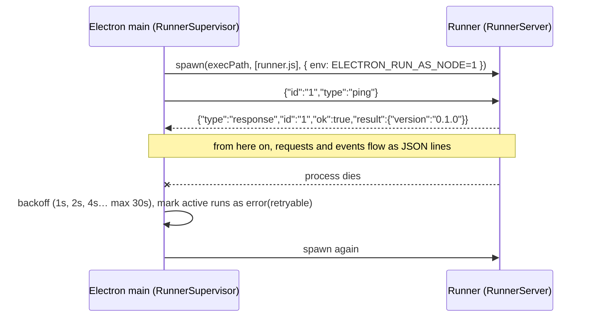

# Comitiva — Technical Design

> `SPEC.md` says **what**; this document says **how**: step-by-step bootstrapping, file layout, data model, main classes and methods, flows, commands. It is written to be read by Claude Code together with `SPEC.md`; phase prompts should reference it.
>
> Signatures are skeletons: names and responsibilities matter, implementation details are left to each phase.

---

## 1. How to bootstrap the project (Phase 0, step by step)

### 1.1 Prerequisites

| Tool | Version | Why |
|---|---|---|
| Node.js | 24 (`.nvmrc`; packages support ≥ 22) | same Node as Electron 44, which runs the runner in the app |
| pnpm | 10 (pinned in `packageManager`, via corepack) | workspaces (pnpm 12 does not honor the hoisted linker, ADR 0006) |
| Git | any | |
| Python 3 + build tools (Xcode CLT / VS Build Tools / `build-essential`) | | compile `better-sqlite3` |
| Claude Code, Codex CLI | optional | test harnesses in Phase 2 |

### 1.2 Command sequence

The Phase 0 bootstrap as it was actually done (the history is in git):

```bash
# 1. Repository and workspace
git init && corepack enable
cat > pnpm-workspace.yaml <<'EOF2'
packages:
  - packages/*
  - apps/*
nodeLinker: hoisted            # electron-builder and native modules prefer hoisted
onlyBuiltDependencies: [better-sqlite3, electron, esbuild]
ignoredBuiltDependencies: [electron-winstaller]
EOF2
mkdir -p packages/{contract,runner,mcp-servers} apps/desktop docs/adr

# 2. Root tooling (versions pinned per ADR 0006)
pnpm add -Dw typescript@~6.0 turbo eslint@^10 prettier @eslint/js typescript-eslint \
  eslint-config-prettier eslint-plugin-react-hooks globals vitest @types/node

# 3. contract
pnpm --filter @comitiva/contract add zod@^4 && pnpm --filter @comitiva/contract add -D tsup tsx

# 4. runner (MCP SDK, OpenAI and Gemini clients join in their phases)
pnpm --filter @comitiva/runner add @anthropic-ai/sdk pino zod@^4 && pnpm --filter @comitiva/runner add -D tsup tsx

# 5. mcp-servers (scaffold only in Phase 0)
pnpm --filter @comitiva/mcp-servers add -D tsup

# 6. desktop (electron-vite layout written by hand; no scaffolder)
cd apps/desktop
pnpm add better-sqlite3
pnpm add -D electron@44.4.2 electron-vite@^5 vite@^7 @vitejs/plugin-react@^5 react@^19 react-dom@^19 \
  @types/react @types/react-dom tailwindcss@^4 @tailwindcss/vite@^4 zustand i18next react-i18next \
  drizzle-orm drizzle-kit ulid @types/better-sqlite3 electron-builder @playwright/test \
  @comitiva/contract@workspace:* @comitiva/runner@workspace:*
```

No `electron-rebuild` step: better-sqlite3 13 is N-API, so the same binary loads in Node (tests) and Electron (app). electron-builder rebuilds or fetches native modules when packaging.

### 1.3 Root configuration files

`package.json` (root):

```json
{
  "name": "comitiva",
  "private": true,
  "scripts": {
    "dev": "turbo run dev --filter=desktop",
    "build": "turbo run build",
    "lint": "turbo run lint",
    "typecheck": "turbo run typecheck",
    "test": "turbo run test",
    "format": "prettier --write .",
    "format:check": "prettier --check .",
    "contract:schema": "pnpm --filter @comitiva/contract run schema",
    "runner:dev": "pnpm --filter @comitiva/runner run dev",
    "package": "turbo run build --filter=desktop... && pnpm --filter desktop run package"
  }
}
```

`turbo.json`:

```json
{
  "$schema": "https://turbo.build/schema.json",
  "envMode": "loose",
  "tasks": {
    "build": { "dependsOn": ["^build"], "outputs": ["dist/**", "out/**"] },
    "dev": { "cache": false, "persistent": true, "dependsOn": ["^build"] },
    "lint": { "dependsOn": ["^build"] },
    "typecheck": { "dependsOn": ["^build"] },
    "test": { "dependsOn": ["^build"] }
  }
}
```

`tsconfig.base.json` (extended by every package):

```json
{
  "compilerOptions": {
    "target": "ES2022", "module": "ESNext", "moduleResolution": "Bundler",
    "strict": true, "noUncheckedIndexedAccess": true, "exactOptionalPropertyTypes": true,
    "skipLibCheck": true, "esModuleInterop": true, "resolveJsonModule": true, "isolatedModules": true
  }
}
```

`envMode: loose` is deliberate: strict mode hid `DBUS_SESSION_BUS_ADDRESS`/`XDG_*` from `pnpm dev`, which broke `safeStorage` on Linux. `schema/**` is not a build output; it is generated by `pnpm contract:schema` and committed.

The real `tsconfig.base.json` also sets `lib: ["ES2023"]`, `verbatimModuleSyntax`, `noImplicitOverride` and `forceConsistentCasingInFileNames`. Each package extends it and adds `"types": ["node"]` (TS 6 no longer includes `@types/*` automatically). Libraries build JS with tsup and declarations with `tsc -p tsconfig.build.json` (tsup's DTS step is incompatible with TS 6).

Build order: `contract` → `runner` and `mcp-servers` → `desktop`. `turbo` resolves this through `dependsOn: ["^build"]`.

### 1.4 Package names

| Directory | `name` | Publishable |
|---|---|---|
| packages/contract | `@comitiva/contract` | yes (the Laravel hub consumes `schema/`; subpath `./ipc-channels` has no zod) |
| packages/runner | `@comitiva/runner` | yes (bin `comitiva-runner` = `dist/bin.cjs`; subpaths `./bin`, `./testing`) |
| packages/mcp-servers | `@comitiva/mcp-servers` | yes (bins `comitiva-mcp-filesystem`, `comitiva-mcp-gdrive`) |
| apps/desktop | `desktop` | no |

### 1.5 Phase 0 exit checklist

- [x] `pnpm lint && pnpm typecheck && pnpm test` green
- [x] `pnpm dev` opens a window; `app.getVersion` returns the version via IPC (through `Backend.app.getVersion()`)
- [x] runner starts as a child process and answers `ping`
- [x] spike: two Anthropic responses streaming simultaneously, independent cancel (e2e against a fake provider; real key pending, see STATUS)
- [x] runner event → paint latency measured and recorded in `docs/STATUS.md`
- [x] ADRs: ORM, license, runner execution, canonical block format (plus JSON Schema, toolchain)
- [ ] CI green on mac/win/linux (workflow written and replayed locally; the repo has no remote yet)

---

## 2. File layout

Files marked *(Pn)* arrive in phase n; everything else exists as of Phase 0.

```
packages/contract/src/
├── index.ts
├── common.ts          Id, IsoDate
├── entities/          connection.ts agent.ts conversation.ts message.ts tool-server.ts
│                      tool-approval.ts usage-record.ts usage-policy.ts
├── blocks.ts          Block = TextBlock | ImageBlock | DocumentBlock | ToolUseBlock | ToolResultBlock
├── provider-config.ts ProviderId, per-provider config schemas (Connection is a union on `provider`)
├── errors.ts          ErrorCode, AppErrorShape, AppError
├── runner-protocol.ts RunnerRequest, RunnerEvent, results (PingResult, TestResult, …), PROTOCOL_VERSION
├── ipc.ts             desktop IPC contract (channels + input/output schemas, DesktopApi, IpcResult)
├── ipc-channels.ts    channel names only (no zod) for the sandboxed preload
└── schema.ts          zod → JSON Schema; scripts/write-schema.ts writes ../schema/*.json

packages/runner/src/
├── bin.ts             entry: new RunnerServer({ input: stdin, output: stdout }).start()
├── index.ts           public API: RunnerClient
├── version.ts
├── server/            RunnerServer.ts Transport.ts RequestRouter.ts
├── runs/              RunManager.ts Run.ts            ToolLoop.ts PermissionGate.ts (P5)
├── providers/         ProviderRegistry.ts ProviderAdapter.ts
│   ├── api/           AnthropicAdapter.ts             OpenAICompatibleAdapter.ts GoogleAdapter.ts OllamaAdapter.ts (P1)
│   └── cli/           CliHarnessAdapter.ts ClaudeCodeAdapter.ts CodexAdapter.ts parsers/ (P2)
├── mcp/               McpClientManager.ts McpClient.ts ToolCatalog.ts (P5)
├── usage/             UsageCalculator.ts pricing.json Tokenizer.ts (P6)
├── client/            RunnerClient.ts        (embedded by shells)
├── testing/           fakeAnthropic.ts fixtures.ts  (exported as @comitiva/runner/testing)
└── util/              jsonl.ts errors.ts logger.ts

packages/mcp-servers/src/            index.ts (scaffold)
├── filesystem/        server.ts RootGuard.ts tools/*.ts approval.ts (P5)
└── google-drive/      server.ts drive-api.ts tools/*.ts (P5b)

apps/desktop/
├── electron.vite.config.ts electron-builder.yml drizzle.config.ts playwright.config.ts
├── e2e/spike.spec.ts
└── src/
    ├── main/
    │   ├── index.ts                 bootstrap: app.whenReady → Database → SecretStore → RunnerSupervisor → IpcRouter → window
    │   ├── paths.ts                 runner entry, migrations, userData files (dev vs packaged)
    │   ├── runner/                  RunnerSupervisor.ts RotatingLog.ts
    │   ├── db/                      schema.ts Database.ts migrations/0000_init.sql (+ meta/)   repositories/*.ts (P1+)
    │   ├── secrets/                 SecretStore.ts ElectronSecretStore.ts
    │   ├── services/                SpikeService.ts (P0 only)
    │   │                            ConversationService.ts AgentService.ts ConnectionService.ts
    │   │                            ToolServerService.ts ApprovalService.ts UsageService.ts TitleService.ts (P1+)
    │   ├── ipc/                     IpcRouter.ts invoke.ts (runInvoke: validate in, strip out)
    │   └── oauth/                   GoogleOAuth.ts (P5b)
    ├── preload/index.ts             exposes the typed, allowlisted window.api (DesktopApi from contract/ipc.ts)
    └── renderer/
        ├── index.html               CSP
        └── src/
            ├── backend/             Backend.ts LocalBackend.ts (RemoteBackend.ts in Phase 8)
            ├── store/               spike.ts context.tsx (P0)   agents.ts conversations.ts messages.ts ui.ts (P3+)
            ├── lib/                 paint.ts stats.ts
            ├── components/          KeyBar.tsx Pane.tsx (P0)   Sidebar/ Chat/ Composer/ ToolBlock/ ApprovalCard/ Forms/ Settings/
            ├── screens/             ChatScreen ConnectionsScreen ToolsScreen UsageScreen SettingsScreen (P1+)
            └── i18n/                index.ts en.json pt-BR.json
```

---

## 3. Data model

### 3.1 Diagram

```mermaid
erDiagram
    CONNECTION ||--o{ AGENT : "uses"
    AGENT ||--o{ CONVERSATION : "has"
    CONVERSATION ||--o{ MESSAGE : "contains"
    AGENT }o--o{ TOOL_SERVER : "enables (agent_tool_server)"
    AGENT ||--o{ AGENT_ROOT : "roots"
    CONVERSATION ||--o{ TOOL_APPROVAL : "approvals"
    MESSAGE ||--o{ USAGE_RECORD : "generates"
    CONNECTION ||--o{ USAGE_RECORD : "consumption"
    CONNECTION ||--o| USAGE_POLICY : "limit (Phase 10)"

    CONNECTION { text id PK; text name; text kind; text provider; json config; text secret_ref; int enabled; text created_at; text updated_at }
    AGENT { text id PK; text name; text avatar; text connection_id FK; text model; text role; json params; text permission_policy; json fallback_connection_ids; json tags; text created_at; text updated_at }
    AGENT_ROOT { text agent_id FK; text path; text mode }
    TOOL_SERVER { text id PK; text name; text transport; text command; json args; json env; text url; json headers; int builtin; int enabled }
    CONVERSATION { text id PK; text agent_id FK; text title; text status; text harness_session_id; int archived; text last_activity_at; text created_at }
    MESSAGE { text id PK; text conversation_id FK; text role; json content; text status; int seq; text created_at }
    TOOL_APPROVAL { text id PK; text conversation_id FK; text agent_id; text tool_server_id; text tool_name; text tool_use_id; json input; text decision; text decided_at }
    USAGE_RECORD { text id PK; text connection_id FK; text agent_id; text conversation_id; text message_id; text model; int input_tokens; int output_tokens; int cache_read_tokens; int cache_write_tokens; int estimated; real cost_usd; int latency_ms; text created_at }
    USAGE_POLICY { text connection_id PK; int max_tokens_day; real max_cost_day; int max_concurrent; text window_start; text window_end }
```

### 3.2 Initial DDL (SQLite, migration 0000_init)

The source of truth is the Drizzle schema in `apps/desktop/src/main/db/schema.ts` (ADR 0003). `drizzle-kit generate` produces `migrations/0000_init.sql`, which is equivalent to the DDL below except for the last table: Drizzle tracks applied migrations in `__drizzle_migrations`, not `schema_migrations`. Booleans are INTEGER, and JSON columns are TEXT with `'[]'`/`'{}'` defaults.

```sql
CREATE TABLE connections (
  id TEXT PRIMARY KEY, name TEXT NOT NULL, kind TEXT NOT NULL CHECK (kind IN ('api','cli')),
  provider TEXT NOT NULL, config TEXT NOT NULL DEFAULT '{}', secret_ref TEXT,
  enabled INTEGER NOT NULL DEFAULT 1, created_at TEXT NOT NULL, updated_at TEXT NOT NULL
);

CREATE TABLE tool_servers (
  id TEXT PRIMARY KEY, name TEXT NOT NULL, transport TEXT NOT NULL CHECK (transport IN ('stdio','http')),
  command TEXT, args TEXT NOT NULL DEFAULT '[]', env TEXT NOT NULL DEFAULT '{}',
  url TEXT, headers TEXT NOT NULL DEFAULT '{}', builtin INTEGER NOT NULL DEFAULT 0,
  enabled INTEGER NOT NULL DEFAULT 1, created_at TEXT NOT NULL
);

CREATE TABLE agents (
  id TEXT PRIMARY KEY, name TEXT NOT NULL, avatar TEXT NOT NULL,
  connection_id TEXT NOT NULL REFERENCES connections(id) ON DELETE RESTRICT,
  model TEXT, role TEXT NOT NULL DEFAULT '', params TEXT NOT NULL DEFAULT '{}',
  permission_policy TEXT NOT NULL DEFAULT 'ask',
  fallback_connection_ids TEXT NOT NULL DEFAULT '[]', tags TEXT NOT NULL DEFAULT '[]',
  created_at TEXT NOT NULL, updated_at TEXT NOT NULL
);
CREATE INDEX idx_agents_connection ON agents(connection_id);

CREATE TABLE agent_roots (
  agent_id TEXT NOT NULL REFERENCES agents(id) ON DELETE CASCADE,
  path TEXT NOT NULL, mode TEXT NOT NULL CHECK (mode IN ('read','readwrite')),
  PRIMARY KEY (agent_id, path)
);

CREATE TABLE agent_tool_servers (
  agent_id TEXT NOT NULL REFERENCES agents(id) ON DELETE CASCADE,
  tool_server_id TEXT NOT NULL REFERENCES tool_servers(id) ON DELETE CASCADE,
  PRIMARY KEY (agent_id, tool_server_id)
);

CREATE TABLE conversations (
  id TEXT PRIMARY KEY, agent_id TEXT NOT NULL REFERENCES agents(id) ON DELETE CASCADE,
  title TEXT, status TEXT NOT NULL DEFAULT 'idle',
  harness_session_id TEXT, archived INTEGER NOT NULL DEFAULT 0,
  last_activity_at TEXT NOT NULL, created_at TEXT NOT NULL
);
CREATE INDEX idx_conversations_agent ON conversations(agent_id, archived, last_activity_at DESC);

CREATE TABLE messages (
  id TEXT PRIMARY KEY, conversation_id TEXT NOT NULL REFERENCES conversations(id) ON DELETE CASCADE,
  role TEXT NOT NULL CHECK (role IN ('user','assistant','tool')),
  content TEXT NOT NULL DEFAULT '[]', status TEXT NOT NULL DEFAULT 'complete',
  seq INTEGER NOT NULL, created_at TEXT NOT NULL
);
CREATE UNIQUE INDEX idx_messages_conv_seq ON messages(conversation_id, seq);

CREATE TABLE tool_approvals (
  id TEXT PRIMARY KEY, conversation_id TEXT NOT NULL REFERENCES conversations(id) ON DELETE CASCADE,
  agent_id TEXT NOT NULL, tool_server_id TEXT NOT NULL, tool_name TEXT NOT NULL,
  tool_use_id TEXT NOT NULL, input TEXT NOT NULL,
  decision TEXT NOT NULL CHECK (decision IN ('allow','deny','allow-always')), decided_at TEXT NOT NULL
);
CREATE INDEX idx_approvals_always ON tool_approvals(agent_id, tool_server_id, tool_name) WHERE decision = 'allow-always';

CREATE TABLE usage_records (
  id TEXT PRIMARY KEY, connection_id TEXT NOT NULL, agent_id TEXT NOT NULL,
  conversation_id TEXT NOT NULL, message_id TEXT, model TEXT NOT NULL,
  input_tokens INTEGER, output_tokens INTEGER, cache_read_tokens INTEGER, cache_write_tokens INTEGER,
  estimated INTEGER NOT NULL DEFAULT 0, cost_usd REAL, latency_ms INTEGER, created_at TEXT NOT NULL
);
CREATE INDEX idx_usage_conn_time ON usage_records(connection_id, created_at);
CREATE INDEX idx_usage_agent_time ON usage_records(agent_id, created_at);

-- applied migrations are tracked by Drizzle in __drizzle_migrations
```

Conventions: ids are ULIDs (sortable); dates are ISO 8601 UTC; JSON in TEXT columns is validated by zod on read and write; `seq` in `messages` is incremented per conversation and is used for ordering and for reconciliation with the hub.

### 3.3 Message blocks (canonical)

```ts
type Block =
  | { type: 'text'; text: string }
  | { type: 'image'; source: { kind: 'base64'; mediaType: string; data: string } | { kind: 'file'; path: string } }
  | { type: 'document'; name: string; mediaType: string; source: /* same */ }
  | { type: 'tool_use'; id: string; toolServerId: string; name: string; input: unknown }
  | { type: 'tool_result'; toolUseId: string; content: Array<TextBlock | ImageBlock | DocumentBlock>; isError: boolean; durationMs?: number };
```

`tool_result.content` cannot nest `tool_use`/`tool_result`, the same restriction as the Anthropic API (ADR 0004).

An `assistant` message can mix `text` and `tool_use`; the following `tool` message carries the `tool_result`s. Adapters translate to the provider's format (OpenAI uses `tool_calls`/`role: tool`; Gemini uses `functionCall`/`functionResponse`).

---

## 4. Runner

### 4.1 Lifecycle



### 4.2 Classes

```ts
// server/Transport.ts — JSON lines over streams
class JsonLinesTransport {
  constructor(input: NodeJS.ReadableStream, output: NodeJS.WritableStream);
  onMessage(handler: (msg: unknown) => void): void;
  send(msg: RunnerEvent): void;        // serializes + '\n'; never throws
}

// server/RunnerServer.ts
class RunnerServer {
  constructor(transport: JsonLinesTransport, deps: { registry: ProviderRegistry; mcp: McpClientManager; runs: RunManager });
  start(): void;                        // validates each line with the RunnerRequest schema, dispatches to RequestRouter
  stop(): Promise<void>;                // cancels runs, closes MCP clients
}

// server/RequestRouter.ts
class RequestRouter {
  handle(req: RunnerRequest): Promise<unknown>;   // switch on req.type → matching method
  // connection.test → registry.get(provider).testConnection
  // connection.listModels → registry.get(provider).listModels
  // toolServer.start/stop → mcp.start/stop
  // run.start → runs.start ; run.cancel → runs.cancel ; run.approval → runs.resolveApproval
}

// runs/RunManager.ts — one Run per runId, all concurrent
class RunManager {
  constructor(registry: ProviderRegistry, emit: (e: RunEvent) => void, logger: Logger);
  start(req: RunStartRequest): void;                 // creates Run, does not block; duplicate runId → invalid_request
  cancel(runId: string): boolean;                    // AbortController.abort(); idempotent, false if unknown
  cancelAll(timeoutMs?: number): Promise<void>;      // on shutdown / stdin close
  resolveApproval(runId: string, toolUseId: string, decision: ApprovalDecision): void;
  active(): string[];
}

// runs/Run.ts — Phase 0 takes (req, adapter, emit, logger); tools and gate join in Phase 5
class Run {
  constructor(req: RunStartRequest, adapter: ProviderAdapter, tools: ToolCatalog, gate: PermissionGate, emit: (e: RunnerEvent) => void);
  execute(): Promise<void>;
  // guarantees exactly one terminal event (run.done | run.error) and nothing after it; stamps runId + ts
  // model = agent.model ?? connection.config.defaultModel, else invalid_request
  // builds RunInput, creates RunContext { tools, callTool }, iterates adapter.run(...)
  // translates AdapterEvent → RunnerEvent with runId; measures latency; collects usage
  private callTool(toolUseId: string, name: string, input: unknown): Promise<ToolResult>;
  // → gate.check(...) → if approval is needed, emits run.tool_call{requiresApproval:true} and awaits a promise
  // → tools.call(...) → emits run.tool_result
}

// runs/ToolLoop.ts — used by the API adapters (Phase 5; the Phase 0 Anthropic adapter streams one turn)
async function* toolLoop(opts: {
  callModel: (messages: Message[], tools: ToolDef[], signal: AbortSignal) => AsyncIterable<AdapterEvent>;
  ctx: RunContext; messages: Message[]; maxIterations: number; signal: AbortSignal;
}): AsyncIterable<AdapterEvent>
// loop: call model → accumulate tool_use → for each, ctx.callTool → append tool_result → repeat until stopReason != 'tool_use'

// runs/PermissionGate.ts
class PermissionGate {
  constructor(policy: PermissionPolicy, alwaysAllowed: Set<string> /* `${serverId}:${tool}` */);
  check(tool: ToolDef): 'allow' | 'ask' | 'deny';
  // read-only (annotations.readOnlyHint) → allow
  // policy read-only + tool not read-only → deny
  // allow-always recorded → allow ; policy allow-writes → allow ; otherwise ask
}
```

```ts
// providers/ProviderAdapter.ts
interface ProviderAdapter {
  readonly id: ProviderId;
  readonly kind: 'api' | 'cli';
  readonly capabilities: Capabilities;
  testConnection(config: ConnectionConfig, secret?: string): Promise<TestResult>;
  listModels?(config: ConnectionConfig, secret?: string): Promise<ModelInfo[]>;
  run(input: RunInput, ctx: RunContext, signal: AbortSignal): AsyncIterable<AdapterEvent>;
}

interface RunContext {
  tools: ToolDef[];                                            // aggregated from the agent's servers
  callTool(toolUseId: string, name: string, input: unknown): Promise<ToolResult>;
  mcpConfigForCli(): Promise<{ path: string; cleanup(): void }>; // temporary file for harnesses
  log(level: 'debug' | 'info' | 'warn', msg: string): void;
}

// providers/ProviderRegistry.ts
class ProviderRegistry {
  register(adapter: ProviderAdapter): void;
  get(id: ProviderId): ProviderAdapter;                        // throws UnknownProviderError
  list(): ProviderDescriptor[];                                // used by the UI to build forms
}

// providers/api/AnthropicAdapter.ts (pattern for the others)
class AnthropicAdapter implements ProviderAdapter {
  private client(config, secret): Anthropic;
  private toProviderMessages(messages: Message[]): MessageParam[];   // Block[] → Anthropic format
  private toProviderTools(tools: ToolDef[]): Tool[];
  run(input, ctx, signal) { return toolLoop({ callModel: (m, t, s) => this.stream(m, t, s), ... }); }
  private async *stream(...): AsyncIterable<AdapterEvent>;          // SDK stream → text_delta/tool_use/usage/done
  // apiKey is always explicit (never ambient env); errors → auth_failed | rate_limited | provider_unavailable |
  // provider_error | timeout; abort → usage (estimated if no message_delta yet) + done(cancelled)
}

// providers/cli/CliHarnessAdapter.ts
abstract class CliHarnessAdapter implements ProviderAdapter {
  kind = 'cli' as const;
  protected abstract buildArgs(input: RunInput, mcpConfigPath?: string): string[];
  protected abstract parseLine(line: string): AdapterEvent[];    // one JSON line → zero or more events
  protected abstract versionArgs(): string[];
  protected locateBinary(config: CliConfig): Promise<string>;     // config.binaryPath || which()
  protected spawn(bin, args, opts: { cwd; env; signal }): ChildProcess;
  async *run(input, ctx, signal) { /* mcp config → spawn → readline stdout → parseLine → yield; stderr → error */ }
  async testConnection(config) { /* locate → --version → minimal prompt */ }
}
class ClaudeCodeAdapter extends CliHarnessAdapter { /* -p, --output-format stream-json, --resume, --mcp-config */ }
class CodexAdapter extends CliHarnessAdapter { /* exec --json ... verified via --help */ }
```

```ts
// mcp/McpClientManager.ts
class McpClientManager {
  start(server: ToolServer, secrets: Record<string, string>): Promise<ToolDef[]>;  // idempotent
  stop(serverId: string): Promise<void>;
  catalogFor(serverIds: string[]): ToolCatalog;
  private restartOnFailure(serverId: string): void;
}

// mcp/ToolCatalog.ts — aggregated view for a run
class ToolCatalog {
  defs(): ToolDef[];                                            // prefixed names: `${serverSlug}__${tool}` to avoid collisions
  call(name: string, input: unknown, signal: AbortSignal): Promise<ToolResult>;
  resolve(name: string): { serverId: string; tool: ToolDef };
}

// usage/UsageCalculator.ts
class UsageCalculator {
  constructor(pricing: PricingTable, overrides?: PricingTable);
  cost(model: string, usage: TokenUsage): number | null;
  estimate(messages: Message[], output: string): TokenUsage;   // approximate fallback, estimated=true
}

// client/RunnerClient.ts — what shells embed
class RunnerClient extends EventEmitter {
  constructor(opts: { spawn: () => ChildProcess; requestTimeoutMs?: number });
  start(): Promise<PingResult>;                                 // spawn + ping; call again after 'crash' to restart
  request<T>(req: Omit<RunnerRequest, 'id'>): Promise<T>;       // correlates by id; AppError on failure
  startRun(req: RunStartPayload): { runId: string };            // returns at once; start failures arrive as run.error
  cancelRun(runId: string): void;
  approve(runId: string, toolUseId: string, decision: ApprovalDecision): void;
  testConnection(req): Promise<TestResult>;
  activeRunIds(): string[];
  on(event: 'run.event', h: (e: RunEvent & { receivedAt: number }) => void): this;
  on(event: 'log', h: (e: LogEvent) => void): this;
  on(event: 'crash', h: (code: number | null, signal) => void): this;   // active runs already got run.error(runner_crashed)
  on(event: 'exit', h: () => void): this;                               // after stop()
  stop(): Promise<void>;                                        // shutdown request, SIGKILL after timeout
}
```

### 4.3 Flow of a turn with a tool and approval

```mermaid
sequenceDiagram
    actor U as User
    participant UI as Renderer
    participant CS as ConversationService (main)
    participant RC as RunnerClient
    participant R as Run (runner)
    participant A as Adapter (API)
    participant FS as MCP filesystem

    U->>UI: sends "reorganize the reports"
    UI->>CS: sendMessage(convId, blocks)
    CS->>CS: persists user msg; status=running
    CS->>RC: run.start {agent, connection, secret, messages, alwaysAllowed}
    RC->>R: JSON line
    R->>A: run(input, ctx)
    A-->>R: text_delta*
    R-->>CS: run.text_delta (batched in CS every ~50ms)
    CS-->>UI: stream
    A-->>R: tool_use fs__list_dir
    R->>R: gate.check → allow (read-only)
    R->>FS: tools/call list_dir
    FS-->>R: result
    R-->>CS: run.tool_call{requiresApproval:false}, run.tool_result
    A-->>R: tool_use fs__move
    R->>R: gate.check → ask
    R-->>CS: run.tool_call{requiresApproval:true}
    CS->>CS: status=awaiting-approval
    CS-->>UI: ApprovalCard
    U->>UI: "Always allow"
    UI->>CS: approve(convId, toolUseId, 'allow-always')
    CS->>CS: stores tool_approval
    CS->>RC: run.approval
    RC->>R: JSON line → promise resolved
    R->>FS: tools/call move
    FS-->>R: ok
    R-->>CS: run.tool_result
    A-->>R: text_delta* , done, usage
    R-->>CS: run.usage, run.done
    CS->>CS: persists assistant/tool msg, usage_record; status=idle
    CS-->>UI: done
```

Batching: `ConversationService` accumulates `text_delta` and writes to SQLite every ~250 ms or at the end of the run; to the UI, it forwards once per frame (16 ms, chosen from the Phase 0 measurements in `docs/STATUS.md`; 50 ms added ~35 ms of visible lag). Never one `UPDATE` per token and never one IPC message per token.

---

## 5. Built-in MCP servers

```ts
// mcp-servers/src/filesystem/RootGuard.ts
class RootGuard {
  constructor(roots: Array<{ path: string; mode: 'read' | 'readwrite' }>);
  resolve(requested: string, op: 'read' | 'write'): string;
  // realpath of the candidate AND of each root; requires realpath(candidate) to start with realpath(root) + sep
  // for write, requires a readwrite root; for paths that do not exist yet, validates the parent directory
  // throws OutsideRootsError / ReadOnlyRootError — never returns a path outside the roots
}

// mcp-servers/src/filesystem/server.ts — arguments: --root <path>:<mode> (repeatable)
// tools: list_dir, read_file, search (glob + content), write_file, create_dir, move, delete
// annotations: list_dir/read_file/search → readOnlyHint:true ; delete/move → destructiveHint:true
// approval: the server does NOT approve anything; the runner decides before calling tools/call (PermissionGate).
// For CLI harnesses that call the server directly, the server receives --approval-socket <path>
// and asks the runner over a local socket before executing writes (Phase 5, design to be confirmed).
```

```ts
// mcp-servers/src/google-drive/server.ts — tokens via env GDRIVE_ACCESS_TOKEN (refreshed by the desktop)
// tools: search, read (Docs → text/markdown, Sheets → CSV), create (doc/text), update, move
// analogous annotations
```

---

## 6. Desktop — main process

```ts
// main/runner/RunnerSupervisor.ts
class RunnerSupervisor extends EventEmitter<{ status: [RunnerStatus] }> {
  constructor(opts: { runnerEntry: string; logFile: string; command?: string; env?; backoff? });
  readonly client: RunnerClient;  // services subscribe to client 'run.event'
  status: 'starting' | 'ready' | 'restarting' | 'stopped';
  start(): Promise<void>;         // spawn process.execPath with ELECTRON_RUN_AS_NODE=1 (ADR 0002); stderr → RotatingLog
  private onCrash(): void;        // backoff 1s, 2s, 4s… 30s (reset after 30s stable); client already failed active runs
  stop(): Promise<void>;
}

// main/db/Database.ts
class Database {
  static open(path: string): Database;   // WAL, foreign_keys=ON, busy_timeout
  migrate(migrationsFolder: string): void; // Drizzle migrator; tracked in __drizzle_migrations
  transaction<T>(fn: () => T): T;
  raw: BetterSqlite3.Database;
  orm: BetterSQLite3Database<typeof schema>;
}

// main/db/repositories/*.ts — common pattern
interface Repository<T, Create, Update> {
  list(filter?): T[]; get(id): T | null; create(data: Create): T; update(id, data: Update): T; delete(id): void;
}
class ConnectionRepository implements Repository<Connection, ...> { /* + hasAgents(id) */ }
class AgentRepository { /* + roots/toolServers loaded together; alwaysAllowed(agentId) */ }
class ConversationRepository { /* + listByAgent(agentId, {archived}); setStatus; setHarnessSession; touch */ }
class MessageRepository { /* + listByConversation(id, {limit, before}); appendText(id, text); setContent; setStatus; nextSeq */ }
class ToolServerRepository, ToolApprovalRepository, UsageRepository { /* summary(range, groupBy); timeseries */ }

// main/secrets/SecretStore.ts
interface SecretStore {
  set(ref: string, value: string): Promise<void>;
  get(ref: string): Promise<string | null>;
  has(ref: string): Promise<boolean>;
  delete(ref: string): Promise<void>;
}
class ElectronSecretStore implements SecretStore {
  constructor(filePath: string, crypto: SafeStorageLike);   // safeStorage injected (fake in tests)
  // safeStorage.encryptString → file <userData>/secrets.bin (JSON { version: 1, entries: { ref: base64 } }),
  // atomic write (tmp + rename, 0600), serialized
  // refuses to operate (secret_store_unavailable) if !safeStorage.isEncryptionAvailable()
  isWeak(): boolean;              // Linux basic_text backend; main only enables it with COMITIVA_ALLOW_WEAK_SECRET_STORAGE=1
}

// main/services/ConversationService.ts
class ConversationService extends EventEmitter {
  constructor(deps: { db; conversations; messages; agents; connections; approvals; usage; secrets; runner: RunnerClient; title: TitleService });
  create(agentId: string): Conversation;
  sendMessage(conversationId: string, content: Block[]): Promise<void>;
  cancel(conversationId: string): void;
  retryLast(conversationId: string): Promise<void>;
  approve(conversationId: string, toolUseId: string, decision: ApprovalDecision): void;
  private buildRunRequest(conv: Conversation): RunStartPayload;      // agent + connection + secret + history + alwaysAllowed
  private handleRunnerEvent(e: RunnerEvent): void;                   // dispatches by type; keeps a runId → conversationId map
  private flushText(conversationId: string): void;                   // batching for SQLite
  // events emitted to IpcRouter: 'conversation.updated', 'message.delta', 'message.block', 'message.completed', 'approval.requested'
}

// main/ipc/invoke.ts
function runInvoke(channel, rawInput, handler): Promise<IpcResult<Output>>;
// input.safeParse → handler → output.parse (strips unknown keys, so nothing outside the schema reaches the renderer)
// errors → { ok: false, error: AppErrorShape }. The envelope exists because custom Error props do not cross contextBridge.

// main/ipc/IpcRouter.ts
class IpcRouter {
  constructor(handlers: InvokeHandlers, isTrustedSender: (frameUrl: string) => boolean);
  register(): void;   // for each channel in contract ipcInvokeChannels: ipcMain.handle(channel, (e, input) => runInvoke(...))
  broadcast<C>(channel: C, payload: IpcEventPayload<C>): void;   // webContents.send to all windows
}
```

IPC channels (defined in `contract/ipc.ts`, all with input and output schemas; names also listed in `contract/ipc-channels.ts`). `invoke` resolves to `{ ok: true, value } | { ok: false, error }`, which `LocalBackend` unwraps into a `BackendError` with a `code`.

```
app.getVersion
runner.getStatus
spike.getState | saveApiKey | testApiKey | send | cancel | reset | reportLatency   (Phase 0 only)
connections.list | create | update | delete | test | listModels
toolServers.list | create | update | delete | test | connectGoogle (5b)
agents.list | create | update | delete | duplicate
conversations.listByAgent | create | rename | archive | setStatus
messages.list | send | cancel | retry
approvals.decide
usage.summary | timeseries | export
dialogs.pickFolder
events: conversation.updated, message.delta, message.block, message.completed, approval.requested, runner.status
        spike.event (Phase 0 only)
```

---

## 7. Desktop — renderer

```ts
// renderer/src/backend/Backend.ts — the UI only knows this
interface Backend {
  capabilities(): { cliHarnesses: boolean; localRoots: boolean; hub: boolean };
  connections: { list(); create(d); update(id, d); delete(id); test(id); listModels(id) };
  toolServers: { list(); create(d); update(id, d); delete(id); test(id) };
  agents: { list(); create(d); update(id, d); delete(id); duplicate(id) };
  conversations: { listByAgent(agentId); create(agentId); rename(id, t); archive(id) };
  messages: { list(convId, opts?); send(convId, blocks); cancel(convId); retry(convId) };
  approvals: { decide(convId, toolUseId, decision) };
  usage: { summary(range, groupBy); timeseries(range) };
  onEvent(handler: (e: BackendEvent) => void): () => void;
}
class LocalBackend implements Backend { /* delegates to window.api; onEvent subscribes to the event channels */ }
// Phase 0 implements only app.getVersion, runner.getStatus, the temporary spike.* group and onEvent.

// renderer/src/store/*.ts (Zustand)
useAgentsStore:         agents[], selectedAgentId, statusByAgent (derived from conversations), unreadByAgent
useConversationsStore:  byAgent: Record<agentId, Conversation[]>, selectedByAgent
useMessagesStore:       byConversation: Record<convId, Message[]>, streamingText: Record<convId, string>,
                        applyDelta(convId, text), applyBlock(convId, block), complete(convId, message)
useUiStore:             rightPanelOpen, theme, quickSwitcherOpen, pendingApprovals: Record<convId, ToolCallEvent>
```

Main components: `Sidebar/AgentList`, `Sidebar/AgentItem` (status dot + badge), `Chat/ConversationList`, `Chat/MessageList` (virtualized), `Chat/MessageBubble`, `ToolBlock/ToolCallBlock`, `ApprovalCard`, `Composer`, `QuickSwitcher`, `Forms/ConnectionForm` (renders fields from `ProviderDescriptor`), `Forms/AgentForm`, `Forms/ToolServerForm`, `Settings/*`, `Usage/*`.

---

## 8. Everyday commands

```bash
pnpm dev                      # desktop in dev (hot reload in the renderer, restart of main)
pnpm dev -- --noSandbox       # Ubuntu 24.04+ (AppArmor blocks the Chromium sandbox for unpackaged Electron)
pnpm runner:dev               # runner alone (tsx watch): type JSON lines into stdin
echo '{"id":"1","type":"ping"}' | node packages/runner/dist/bin.cjs

pnpm test                     # everything
pnpm --filter @comitiva/runner test -- --watch
pnpm --filter desktop test:e2e    # electron-vite build + Playwright against a fake Anthropic server

pnpm contract:schema          # regenerates packages/contract/schema/*.json (commit it)
pnpm --filter desktop db:generate                                  # Drizzle migration from db/schema.ts (commit it)

pnpm package                  # builds deps (turbo) + electron-builder for the current platform → apps/desktop/release/

# Inspecting the local database
sqlite3 "$HOME/Library/Application Support/comitiva/comitiva.db" '.tables'   # macOS
# Linux: ~/.config/comitiva/ ; Windows: %APPDATA%\comitiva\
```

Debugging the runner: `COMITIVA_RUNNER_LOG=debug pnpm dev` makes the runner log to stderr (never to stdout, which is the protocol channel). Main writes that stderr to `<userData>/logs/runner.log` with rotation (5 MB, one backup).

Other env vars: `COMITIVA_USER_DATA` (override userData, used by e2e), `COMITIVA_ANTHROPIC_BASE_URL` (spike endpoint override), `COMITIVA_ALLOW_WEAK_SECRET_STORAGE=1` (tests/CI: allow Linux `basic_text`), `COMITIVA_DELTA_FLUSH_MS` (latency experiments).

---

## 9. Conventions

- **Errors**: `AppError { code: ErrorCode; message; retryable; cause? }` class in `contract`; adapters map provider errors to stable codes (`auth_failed`, `rate_limited`, `provider_unavailable`, `provider_error`, `timeout`, `binary_not_found`, `not_logged_in`, `outside_roots`, `approval_denied`), and the shell adds `secret_missing`, `secret_store_unavailable`, `runner_crashed`, `runner_unavailable`; protocol-level: `invalid_request`, `not_implemented`, `unknown_provider`, `unsupported_content`, `internal`. The UI translates by code (i18n), never shows a raw provider message as a title.
- **Logs**: `pino` in the runner and in main; levels via env; no message content in logs at `info` level.
- **Secrets**: only `secretRef` in the database and in IPC payloads; the renderer never receives a secret value; the runner receives the value per request and does not persist it.
- **Tests**: runner and mcp-servers with vitest and fakes (a real local fake Anthropic SSE server in `@comitiva/runner/testing` instead of msw, fake in-memory MCP server, fake shell binary for CLI); runner integration tests spawn the bundled `dist/bin.cjs`; desktop main under plain Node with in-memory SQLite (better-sqlite3 is N-API); renderer stores tested with a fake `Backend` (testing-library when components grow); Playwright launches the built app for the two-parallel-conversations flow against the fake provider.
- **Commits**: conventional commits; scope = package (`feat(runner): ...`, `fix(desktop): ...`).
- **ADR**: one per decision that affects more than one package; format: context, decision, consequences.

---

## 10. Implementation order within each phase

General rule: **contract → runner → main → renderer**, with tests at each layer before moving on to the next. A topic is only "done" when Playwright or an integration test exercises the whole path. This applies to every phase and must be stated in `CLAUDE.md`.

---

## 11. Use by Claude Code

Every phase prompt says to read this document together with `SPEC.md`. When the code diverges from it for a good reason, the document is updated in the same commit; it never goes silently out of date.
