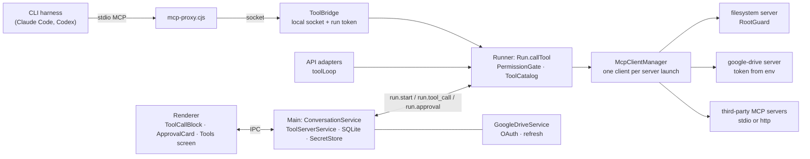

# Tools, roots and approvals

How agents use tools: MCP servers, the built-in `filesystem` server and its roots, the built-in `google-drive` server and its Google account, the permission gate, approvals, and how to add a server. The decisions behind it are in ADR 0009 and ADR 0010; the protocol is in `docs/architecture.md`.

## The pieces



- **ToolServer** (`tool_servers`): an MCP server. `stdio` has a command, args and env; `http` has a URL and headers. Env vars and headers are plain values or secrets: secrets live in the SecretStore under `toolServer:<id>:env:<NAME>` or `toolServer:<id>:header:<NAME>`, and SQLite and the renderer only see the ref. The built-in `filesystem` server has the fixed id `filesystem`. It is seeded by migration `0004`, and its launch is resolved by the shell at run time (the app's own binary in Node mode running `mcp-servers/filesystem.cjs`). The built-in `google-drive` server has the fixed id `google-drive` (migration `0005`); its launch carries a fresh access token (below). Built-ins can be enabled or disabled, never edited or deleted.
- **Agent**: `toolServerIds` (the servers it may use), `roots` (`{ path, mode: 'read' | 'readwrite' }`, in order) and `permissionPolicy` (`ask`, `allow-writes`, `read-only`). The filesystem server is only started for an agent that has roots.
- **ToolApproval** (`tool_approvals`): every decision the user makes, with the conversation, agent, server, tool, input and decision. Rows with `allow-always` are sent in `run.start.alwaysAllowed` as `serverId:toolName`.

## A run with tools

1. `ConversationService` resolves the agent's enabled servers into `ToolServerLaunch`es, with secrets read from the SecretStore. A missing secret refuses the send with `secret_missing`; Google Drive without a usable account refuses it with `google_not_connected` or `google_reconnect_required`. It sends them with the agent's `alwaysAllowed` in `run.start`.
2. The runner acquires each server from `McpClientManager`, which starts it or reuses it. A server that cannot start fails the run with `tool_server_failed`, and later starts back off (1 s, 2 s … 30 s). `ToolCatalog` aggregates the tools with prefixed names (`fs__read_file`, `github__create_issue`), so two servers can share a tool name. Under the `read-only` policy, tools that are not read-only are left out.
3. **API connections**: the adapter streams inside `toolLoop`. Every `tool_use` goes to `ctx.callTool`, and the result goes back to the model, until it stops asking for tools or the iteration limit is reached (`params.maxToolIterations`, default 25; then `run.done { stopReason: 'max_iterations' }`). Usage is summed over the calls into one `run.usage`.
4. **CLI harnesses**: the harness gets an MCP config with a single server, the runner's proxy (below). Its calls reach the same `callTool`.
5. `callTool` emits `run.tool_call`, asks `PermissionGate`, waits for `run.approval` when needed, calls the server with the run's abort signal, and emits `run.tool_result` with `durationMs`. Denials and tool failures are `isError` results that start with a stable code (`approval_denied: …`, `outside_roots: …`, `tool_server_failed: …`), so the model can read them and carry on.
6. Main stores the `tool_use` and `tool_result` blocks in the reply, in order with the text. The runner splits a stored reply into strict assistant/tool turns for the next request (`normalizeHistory`), and gives any call that never finished an error result.

### The permission gate

| Tool | `ask` | `allow-writes` | `read-only` |
|---|---|---|---|
| `readOnlyHint: true` | runs | runs | runs |
| anything else (no annotations included) | asks, unless always allowed | runs | hidden, and refused if called |

"Always allow for this agent" records `allow-always` for that server and tool. It applies to the rest of the run at once, and to every later run of the agent.

### Approvals in the UI

- A `run.tool_call` with `requiresApproval` puts the conversation in `awaiting-approval` with a `pendingApproval` (on `conversation.updated` and in `conversations.list`). The sidebar flags the agent ("Approve"), and the tool block shows an inline card with the paths involved: Allow, Deny, or Always allow for this agent.
- `approvals.decide` records the decision, sends `run.approval`, and puts the conversation back to `running`.
- Tools run one at a time, so a conversation waits on at most one call.
- Stop cancels the run while it waits. Nothing is called, and the tool block ends with no result.

## The filesystem server

`packages/mcp-servers/src/filesystem`. It runs over stdio as `comitiva-mcp-filesystem --root <path>:<mode> … [--gated-by-client]`.

| Tool | Annotations | Does |
|---|---|---|
| `list_dir` | read-only | Lists a folder; without a path, lists the roots |
| `read_file` | read-only | Text (optionally a range of lines, 1 MB cap) or an image |
| `search` | read-only | Name glob (`*`, `?`, `**`) and optional text (case-insensitive); does not follow symlinks |
| `write_file` | destructive | Creates or replaces a text file; creates missing parent folders |
| `create_dir` | not destructive | Creates a folder and its parents |
| `move` | destructive | Moves or renames; refuses to replace a target unless `overwrite` |
| `delete` | destructive | Deletes a file, or a folder with `recursive`; never a root |

- **RootGuard** is the only way a requested path becomes one the server touches:
  - It takes the `realpath` of each root and of the candidate. A path that does not exist yet is resolved through its deepest existing ancestor.
  - It requires the candidate to be a root, or inside one plus a path separator.
  - Relative paths are taken from the first root. The most specific root wins, so a read-only folder inside a read-write one stays read-only.
  - It refuses `..`, absolute paths outside the roots, symlinked files and folders pointing out, and dangling symlinks (a write would follow them). The errors are `outside_roots` and `read_only_root`.
  - Known limit: a process swapping a folder for a symlink between the check and the operation.
- **Write tools exist only with `--gated-by-client`**, and only when at least one root is read-write. The runner always passes the flag, because it asks the user before every write call. A copy of the server started any other way is read-only.

## Google Drive

`packages/mcp-servers/src/google-drive`, our own server (ADR 0010). It runs over stdio as `comitiva-mcp-gdrive [--gated-by-client]` and calls Drive REST v3 with the access token in `GDRIVE_ACCESS_TOKEN`. It never reads a token from disk or writes one. One Google account per app.

| Tool | Annotations | Does |
|---|---|---|
| `search` | read-only | Finds files by text in the name or content, type (`doc`, `sheet`, `slides`, `folder`, `pdf`) and folder. Without a query, it lists the most recently modified files. Returns ids, pages with `pageToken`. |
| `read` | read-only | Google Docs as Markdown, Sheets as CSV (first sheet only), Slides as plain text, text files (1 MB cap), images (5 MB cap). Other binaries → `unsupported_content`. |
| `create` | not destructive | A Google Doc from Markdown, a Sheet from CSV, a plain file (`mimeType`, default `text/plain`), or a folder; optionally inside `parentId` |
| `update` | destructive | Replaces the content (Markdown for Docs, CSV for Sheets, text for text files) and/or renames |
| `move` | destructive | Moves into `toFolderId` (`root` = top of My Drive), optionally renaming |

- Every tool is `openWorldHint`, and every call covers shared drives (`supportsAllDrives`).
- Write tools exist only with `--gated-by-client`, which the runner always passes.
- Errors come back as `isError` results that start with a stable code:
  - `auth_failed`: the token was rejected
  - `rate_limited`
  - `not_found`
  - `invalid_request`
  - `unsupported_content`
  - `tool_failed`
- The tools reach the model as `gdrive__search`, `gdrive__read`, and so on.

### Setting up the OAuth client

Comitiva ships no Google credentials. Each user (or their team) creates an OAuth client once:

1. In [Google Cloud Console](https://console.cloud.google.com/), create a project, or pick an existing one.
2. **APIs & Services → Library**: enable the **Google Drive API**.
3. **APIs & Services → OAuth consent screen**:
   - A personal Google account: user type **External**, publishing status **Testing**. Add yourself (and anyone who will use this client) under **Test users**.
   - Google Workspace: user type **Internal**.
   - Under **Data access**, add the scope `https://www.googleapis.com/auth/drive`.
4. **APIs & Services → Credentials → Create credentials → OAuth client ID**, application type **Desktop app**. No redirect URI to configure: desktop clients accept the loopback address Comitiva listens on.
5. In Comitiva: **Tools → Google Drive → Set up**. Paste the client ID and client secret, then **Save**. Then click **Connect Google Drive**.
   - Your browser opens Google's consent page. Pick the account and allow access.
   - For an app in Testing, Google warns that it is unverified. That is expected: it is your own client.
   - The tab then says you can close it, and the Tools screen shows "Connected as …".
6. Tick **Google Drive** in the agent's **Tools**.

Things to know:

- **External apps in Testing:** Google expires the sign-in after **7 days**. The Tools screen then says "Reconnect needed", and agents with Drive refuse to send until you click **Reconnect**. Publishing the app, or using an Internal app on Workspace, avoids that. Publishing needs Google's verification for the restricted `drive` scope.
- **Changing the client ID** disconnects the account. **Disconnect** asks Google to revoke the sign-in and forgets it; your files are not touched.
- **Shared client:** a team can share one client; each person still signs in with their own account.

### Tokens

- **The flow:** `GoogleOAuth` (main) runs the installed-app flow:
  - a one-shot listener on `127.0.0.1` with a random port, as the redirect URI
  - PKCE S256 and a random `state`: other requests are ignored
  - `access_type=offline` and `prompt=consent`, so Google returns a refresh token
  - a 5-minute timeout, and Cancel
  - It checks that the `drive` scope was granted.
- **Storage:** the client goes in the SecretStore under `google:oauthClient`, and the tokens and account email under `google:tokens`. None of it reaches SQLite, the renderer or logs; the renderer sees only the status: state, email, and whether a secret is stored.
- **Before every run or test with Drive:** `GoogleDriveService.accessToken()` refreshes the token if fewer than 15 minutes are left. Concurrent runs share one refresh. The token goes into the launch as `GDRIVE_ACCESS_TOKEN`.
  - A new token means a new launch, so the runner starts a new instance. The old one closes once idle; idle built-in instances close after 10 minutes anyway.
  - A single run longer than about 15 minutes can hit an expired token (`auth_failed`); the next run gets a fresh one.
- **A refused refresh** (`invalid_grant`) marks the account `reconnect_required`.

## CLI harnesses: the proxy

The harness never starts the real servers (ADR 0009). For a turn with tools:

- The runner registers the run with its `ToolBridge`, which listens on a Unix socket in a 0700 temp dir (a named pipe on Windows). It writes two files, both mode 0600 and removed when the turn ends:
  - a bridge file with the socket and a per-run token
  - an MCP config whose only server is `comitiva`: the runner's own Node binary running `mcp-proxy.cjs <bridge file>`
- **Claude Code** gets:
  - `--mcp-config <file>`
  - `MCP_TOOL_TIMEOUT` of 30 min
  - with the filesystem server, `--tools WebSearch,WebFetch`, so no native Read, Write, Edit or Bash
- **Codex** gets:
  - `-c mcp_servers.comitiva.command=… args=… env=…`
  - `tool_timeout_sec=1800`
  - `default_tools_approval_mode="approve"`, because the runner is the gate and `exec` would otherwise decline writes itself
  - with the filesystem server, `sandbox_mode=read-only`, because `apply_patch` cannot be turned off
- The harness's working directory is the agent's first read-write root. Without one, it is the connection's working directory, else `<userData>/workspaces/<conversationId>`.
- The harness sees the tools as `mcp__comitiva__<prefixed name>`. The parsers drop the harness's own report of those calls. The run reports them itself, using the harness's tool-use id when the proxy gets one (Claude Code sends it in `_meta`).

## Adding an MCP server

In the app: **Tools → Add server**.

- **Local command (stdio)**: the command, one argument per line, and env vars. Tick **Secret** for tokens: they go to the system keyring and are never shown again. Leave a stored secret blank to keep it, or type to replace it. The server starts with only a safe default environment (`HOME`, `PATH`, …) plus these vars, never Comitiva's or a provider's keys.
- **Remote (HTTP)**: a Streamable HTTP URL and headers, which can also be secrets.
- **Test** in the form starts the settings as typed, without saving, and lists the tools. Stored secrets are used for rows left blank. **Test** on a saved server's row does the same. Then tick the server in the agent's **Tools**.
- Each tool shows badges from its MCP annotations:

  | Badge | Meaning |
  |---|---|
  | **Read-only** | Runs without asking. |
  | **Asks first** | Anything not read-only; it asks under the `ask` policy. |
  | **Destructive** | Not read-only, and `destructiveHint` is not `false`. Per MCP, it defaults to true. |
  | **No annotations** | The server says nothing about the tool, so it always asks. |
- Tools the server annotates `readOnlyHint: true` run freely. Everything else asks under the `ask` policy, so a server without annotations asks for every call.

Examples:

```text
Name: Everything (MCP test server)
Command: npx
Arguments:
  -y
  @modelcontextprotocol/server-everything
```

```text
Name: GitHub
URL: https://api.githubcopilot.com/mcp/
Header: Authorization = Bearer <token>   (Secret)
```

Editing or disabling a server stops its client in the runner, and the next run starts it with the new settings. Deleting a server removes its secrets and unlinks it from agents.

## Testing

- `packages/mcp-servers/test`:
  - `RootGuard` against escape attempts in a temp directory
  - every tool over the in-memory transport
  - the bundled binary over stdio
  - Google Drive:
    - every tool over the in-memory transport against `startFakeGoogle` (`@comitiva/mcp-servers/testing`): query escaping, exports, caps, uploads with conversion, moves, the error mapping, and no write tools without the gate flag
    - the bundled binary with the token in env and an empty `HOME` that stays empty
- `packages/runner/test/tools`:
  - `run-tools.test.ts`: the loop, the gate and approvals (granted, denied, allow-always, cancel while waiting and during a slow tool, the iteration limit, a crash and restart, a server that cannot start), with a scripted adapter and the in-memory fake MCP server (`createFakeMcp` in `@comitiva/runner/testing`)
  - `filesystem-binary.test.ts`: the runner binary with the real filesystem server
  - `harness-tools.test.ts`: both fake harnesses through the proxy
  - `units.test.ts`: gate, history, catalog, manager, bridge
  - the adapter conformance suite has a tool round trip per provider
- Fake providers script tool calls with `[tool:NAME {json}]` in the last user message. Fake harnesses call tools through the proxy with `[mcp:NAME {json}]`.
- Desktop:
  - repository, `ToolServerService` and `ConversationService` approval tests
  - `GoogleOAuth.test.ts` against the fake authorization server, with a stub browser that follows the redirect. It covers:
    - PKCE, which the fake verifies
    - a wrong `state` ignored
    - access denied, a missing scope, a wrong secret
    - a timeout, and a cancel
    - refresh and `invalid_grant`, revoke
    - the listener closed afterwards
  - `GoogleDriveService.test.ts`:
    - tokens only in the SecretStore
    - "connecting", cancel, and one attempt at a time
    - refresh before launch, single-flight
    - reconnect_required
    - disconnect revokes and stops the server
    - a new client ID disconnects
  - `ToolServerService`: the Drive launch with a fresh token per launch, and testing unsaved settings
  - store and form tests
  - `e2e/tools.spec.ts`, which includes the Phase 5 exit criterion
  - `e2e/google-drive.spec.ts`, which includes the Phase 5b exit criterion. It runs against the fake Google, via `COMITIVA_GOOGLE_OAUTH_BASE_URL` and `COMITIVA_GOOGLE_API_BASE_URL`, with `shell.openExternal` stubbed as the browser. It covers:
    - setup and connect in the UI
    - an agent reads a Doc and creates another after approval
    - no token or client secret in `comitiva.db*` or IPC
    - disconnect refuses sends
    - a third-party server tested from the form before saving
